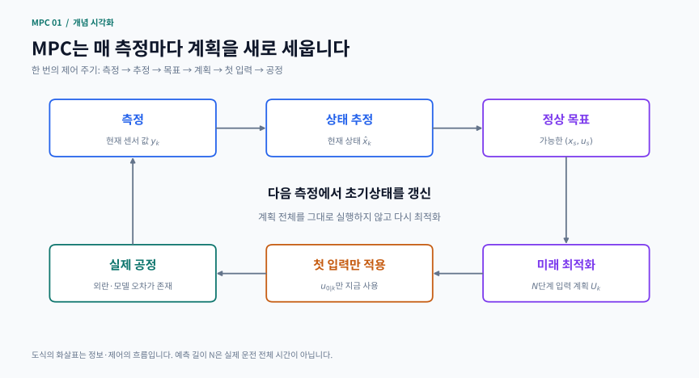
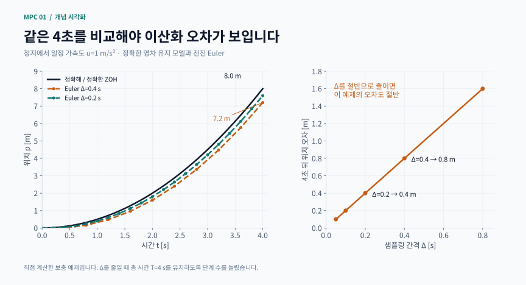

# 1장 · MPC 시작하기

이 글은 Rawlings·Mayne·Diehl 교재 2판 1쇄 Chapter 1을 공부하기 위한 비공식 한국어 학습 노트입니다. 공식 번역이나 원문 전체의 대체물이 아닙니다. 개념 설명과 직접 계산하는 보충 예제로 모델, 최적 제어, 상태 추정, 목표 추종을 연결합니다. 교재 범위는 인쇄 쪽수 1–88이며 PDF 뷰어 번호와 다릅니다.

## 1 학습 목표와 읽는 순서

이번 장이 끝나면 다음 질문에 자신의 말로 답하는 것이 목표입니다.
- MPC는 왜 미래 입력을 여러 개 계산하고 지금은 하나만 적용하는가?
- 연속시간 모델을 샘플링할 때 무엇이 정확해지고 무엇이 근사되는가?
- LQR의 계산상 최적성과 폐루프 안정성은 어떻게 다른가?
- 측정하지 않은 상태를 어떤 정보로 추정하는가?
- 일정한 외란이 있을 때 목표값 오차를 없애려면 무엇을 바꿔야 하는가?

선수 지식은 행렬 곱, 선형 연립방정식, 미분방정식의 기초, 이차함수 최소화, 평균과 공분산입니다. 첫 독해에서는 1.1–1.3으로 제어 순환을 잡고, 두 번째에 1.4의 추정기를 붙인 뒤 1.5의 실제 목표 추종으로 넘어가세요. 식을 외우기 전에 각 벡터가 어느 시점의 무엇인지 표시하면 혼동이 줄어듭니다.

## 2 MPC의 한 번의 순환

현재 측정 → 상태 추정 → 가능한 정상 목표 계산 → 미래 입력 최적화 → 첫 입력 적용 → 다음 측정 순으로 반복합니다. 예측 길이 N은 지금 계산하는 미래 단계 수입니다. 실제 운전 시간 전체와 같지 않습니다.

시점 k에서 x₀ = 현재 상태 추정값으로 두고 입력 열 U = (u₀,…,uₙ₋₁)을 계산합니다. 이 중 u₀만 공정에 적용합니다. 다음 시점에는 모델이 예상하지 못한 외란과 새 측정이 들어오므로 초기상태를 갱신하여 다시 풉니다. 이것이 이동 구간 또는 receding horizon입니다. 예측 입력을 끝까지 그대로 실행하면 처음 세운 계획에만 의존하는 개방루프 운전이 됩니다.

미래를 내다본다는 말이 미래 외란을 정확히 안다는 뜻은 아닙니다. 알고 있는 모델과 가정으로 비교하는 것이므로 모델 오차와 제약 경계의 위험은 이후 장에서 별도로 다룹니다.

직접 제작한 개념 도식 · MPC 한 주기의 정보·제어 흐름

미래 입력 여러 개를 계산하지만 첫 입력만 적용합니다. 다음 측정이 들어오면 추정 상태와 목표를 갱신해 다시 풉니다.

[PNG로 크게 보기](../../docs/assets/diagrams/ch01_receding_loop.png)

## 3 예측 모델과 이산화

기본 선형 이산시간 모델은 다음과 같습니다.

$$
x_{k+1}=Ax_k+Bu_k,\qquad y_k=Cx_k
$$

x는 n차원 상태, u는 m차원 조작 입력, y는 p차원 측정 출력입니다. A는 상태가 다음 시점에 남기는 영향, B는 입력의 영향, C는 센서가 보는 조합입니다. 시변 모델에서는 Aₖ, Bₖ, Cₖ처럼 시간을 붙입니다. 전달함수의 입력–출력 관계를 사용할 때는 영 초기조건 가정을 놓치지 마세요. 상태공간 해에는 초기상태가 만든 응답과 입력이 만든 응답이 모두 있습니다.

연속 모델 ẋ = A꜀x + B꜀u를 샘플링 간격 Δ 동안 일정한 입력으로 운전하면 정확한 영차 유지 모델은

$$
A=e^{A_c\Delta},\qquad B=\int_0^{\Delta}e^{A_c\tau}B_c\,d\tau
$$

입니다. 반면 전진 Euler는 A ≈ I + ΔA꜀, B ≈ ΔB꜀로 근사합니다. Δ를 줄이면 보통 근사 오차는 줄지만, 같은 N에서 바라보는 실제 미래 시간 NΔ도 짧아집니다. 공정 예측과 계산 부담을 함께 봐야 합니다.

온도장이 공간 전체에 분포하는 모델은 격자점마다 상태를 두어 유한차원 모델로 바꿀 수 있습니다. 격자를 촘촘히 하면 공간 근사는 개선되지만 상태 수와 계산량이 늘어납니다. 시간 이산화 오차와 공간 이산화 오차는 다른 원인입니다.

### 손계산 예제 가속하는 물체

위치 p[m], 속도 v[m/s], 입력 가속도 u[m/s²]인 물체가 정지 상태에서 u = 1 m/s²로 움직인다고 합시다. Δ = 0.4 s일 때 정확한 모델은

pₖ₊₁ = pₖ + 0.4vₖ + 0.08uₖ

vₖ₊₁ = vₖ + 0.4uₖ

입니다. Euler에서는 위치 식의 0.08uₖ가 빠집니다. 4초, 즉 10단계 뒤 정확한 위치는 8 m이고 Euler 위치는 7.2 m입니다. 속도는 두 계산 모두 4 m/s입니다. 이 특정 일정 가속도 예제에서 종단 위치 오차는 uTΔ/2이므로 0.8 m입니다. Δ를 0.2 s로 줄이고 단계 수를 20으로 늘리면 오차는 0.4 m가 됩니다.

핵심은 총 시간 T를 고정한 비교입니다. N을 그대로 두고 Δ만 줄이면 서로 다른 시점의 오차를 비교하게 됩니다. 아래 독립 실행 예제에서도 총 시간 T를 고정한 채 샘플 간격을 바꾸어 비교합니다.

보충 계산 시각화 · 정확 모델과 Euler: 총 시간을 고정한 위치 오차 비교

Δ=0.4초에서는 Euler 종단 위치가 7.2 m, 정확값은 8 m입니다. Δ=0.2초·20단계에서는 오차가 0.4 m로 줄어듭니다.

[PNG로 크게 보기](../../docs/assets/diagrams/ch01_discretization.png)

## 4 비용함수와 LQR에서 QP로

가장 기본적인 유한 구간 비용은

$$
J=\frac{1}{2}\sum_{j=0}^{N-1}(x_j^TQx_j+u_j^TRu_j)+\frac{1}{2}x_N^TP_fx_N
$$

입니다. Q는 상태 편차의 중요도, R은 입력 사용의 벌점, P𝒻는 예측 끝 이후 영향을 요약하는 종단 가중치입니다. Q와 P𝒻는 대칭 양의 준정부호, R은 대칭 양의 정부호를 기본으로 생각합니다. 서로 단위가 다른 위치와 속도를 그대로 같은 숫자로 가중하면 의도하지 않은 균형이 생길 수 있습니다. 대표 허용 편차로 정규화한 뒤 가중치를 선택하는 습관이 유용합니다.

동적 계획법은 남은 미래 비용을 Vⱼ(x) = ½xᵀPⱼx로 요약합니다. 한 단계씩 뒤로 계산하면

$$
\begin{gathered}
K_j=-(R+B^TP_{j+1}B)^{-1}B^TP_{j+1}A \\
P_j=Q+A^TP_{j+1}A+A^TP_{j+1}BK_j
\end{gathered}
$$

를 얻습니다. 여기서는 u = Kx로 쓰므로 음의 부호가 K 안에 있습니다. 구현할 때는 역행렬을 만들기보다 선형 연립방정식을 풉니다. 종단 조건 Pₙ = P𝒻에서 시작해 P₀까지 내려오며, MPC에서는 그 시점의 첫 이득을 사용합니다.

같은 문제에서 상태와 입력을 변수로 놓고 동역학을 등식 제약으로 넣으면 이차계획법 QP가 됩니다. 무제약 선형 이차 문제에서는 DP와 QP의 최적 입력 열이 일치해야 합니다. 이 일치는 알고리즘 두 개가 같은 문제를 푸는지 검사하는 좋은 기준입니다.

R을 키우면 대체로 입력 사용을 더 아끼지만 모든 상태의 응답이 항상 단조롭게 느려진다는 일반 명제는 아닙니다. 유한 구간 최적해를 구했다고 반복 적용한 제어가 반드시 안정한 것도 아닙니다. 선형 무제약 피드백을 반복 적용한다면 폐루프 행렬 A + BK의 스펙트럴 반지름을 확인하세요. 이 값이 1보다 작으면 이산시간 선형 폐루프는 점근 안정합니다. 필요한 예측 길이는 모델, 비용과 종단 설계에 따라 달라집니다.

## 5 제약과 재계획을 읽는 방법

입력 크기 |u| ≤ uₘₐₓ, 변화율 |uₖ − uₖ₋₁| ≤ δ, 상태 상한 등을 최적화 문제에 직접 넣을 수 있습니다. 상태 제약을 완화할 때는 비음수 slack ε를 넣고 위반 크기를 벌점화합니다. 연성 제약은 불가능한 요구를 조정하는 설계 선택입니다. 실제 안전 한계가 자동으로 완화 가능한 것은 아니며 입력 clipping만으로 상태 제약을 보장할 수도 없습니다.

제어가능성은 입력으로 상태를 움직일 수 있는 방향을 묻습니다. 선형계에서는 [B, AB,…, Aⁿ⁻¹B]의 계수가 n인지 확인합니다. 제약이 있으면 선형 대수상 제어가능해도 특정 시간 안에 허용 입력만으로 도달하지 못할 수 있습니다.

## 6 보이지 않는 상태를 추정하기

잡음을 포함하면 xₖ₊₁ = Axₖ + Buₖ + wₖ, yₖ = Cxₖ + vₖ입니다. 과정 잡음 w의 공분산은 W, 측정 잡음 v의 공분산은 V로 쓰며 제어 비용 Q, R과 구분합니다. 표준 칼만 필터에서는 영평균 백색 잡음, 알려진 공분산, 초기 오차와 잡음 사이의 적절한 독립성 등을 가정합니다. 선형 Gaussian 모델에서는 조건부 평균으로 해석할 수 있습니다.

측정 전 추정값을 x̂⁻, 공분산을 P⁻라고 하면

$$
\begin{gathered}
L=P^-C^T(CP^-C^T+V)^{-1} \\
\hat{x}^{+}=\hat{x}^{-}+L(y-C\hat{x}^{-}) \\
\hat{x}_{k+1}^{-}=A\hat{x}_{k}^{+}+Bu_k \\
P_{k+1}^{-}=AP_k^{+}A^T+W
\end{gathered}
$$

입니다. y − Cx̂⁻는 측정과 예측의 차이인 innovation입니다. L은 그 차이를 얼마나 믿고 어떤 상태 방향으로 반영할지 정합니다. 직접 측정하지 않은 속도도 위치와의 상관관계 및 동역학을 통해 갱신할 수 있습니다. 실제 코드는 공분산의 수치 대칭성과 양의 성질을 보호하는 Joseph 갱신을 사용합니다.

관측가능성 행렬은 [Cᵀ, (CA)ᵀ,…, (CAⁿ⁻¹)ᵀ]ᵀ입니다. 위치만 측정해도 위치 변화에 속도가 반영되면 속도를 알아낼 수 있습니다. 반대로 속도만 측정하는 적분기에서는 초기 위치의 상수 차이를 구별할 수 없습니다. 검출가능성은 관측할 수 없는 모드가 안정하면 된다는 더 약한 조건입니다.

## 7 최소제곱 추정과 MHE

상태 열 전체를 변수로 두고 초기 prior 오차, 동역학 오차, 측정 오차를 각각 공분산으로 가중하면 배치 최소제곱 문제가 됩니다. rᵀΣ⁻¹r는 불확실성이 작은 방향의 오차를 더 크게 벌점화합니다. 계산에서는 Cholesky 백색화 후 최소제곱을 풀면 역행렬과 정규방정식의 수치 문제를 줄일 수 있습니다.

배치 추정은 뒤에 얻은 측정으로 과거 상태도 고치므로 평활화입니다. 같은 정보와 모델을 쓰면 배치 추정의 마지막 상태는 KF와 일치하지만 과거 모든 상태가 당시의 KF 추정과 같지는 않습니다.

MHE는 최근 창만 남겨 문제 크기를 제한하고, 창 밖 과거 정보는 도착 비용 arrival cost로 요약합니다. 정확한 도착 비용을 쓰는 무제약 선형 Gaussian 경우에는 KF와 맞출 수 있습니다. 도착 비용을 0으로 버리면 다른 정보로 푸는 문제가 됩니다. 여기서 window = 8은 측정 8개와 전이 입력 7개를 뜻합니다. 창 시작 측정을 prior와 목적함수 양쪽에 중복 반영하지 않아야 합니다.

## 8 정상 목표와 외란 보상

측정 y = Cx 중 제어할 조합을 z = Hy라고 하면 목표 r에 대해

$$
(I-A)x_s-Bu_s=0,\qquad HCx_s=r
$$

를 먼저 풉니다. 이후 x − xₛ, u − uₛ를 원점으로 조절합니다. 측정값이 여러 개라고 독립 입력보다 많은 임의 목표를 항상 맞출 수 있는 것은 아닙니다. 실제 입력 범위가 [uₘᵢₙ, uₘₐₓ]이면 편차 입력의 범위도 [uₘᵢₙ − uₛ, uₘₐₓ − uₛ]로 옮겨야 합니다.

일정 외란을 다루려면 dₖ₊₁ = dₖ를 모델에 넣고 xₖ₊₁ = Axₖ + Buₖ + B𝒹dₖ, yₖ = Cxₖ + C𝒹dₖ로 확장합니다. 추정한 d̂를 정상 목표 계산에도 반영해야 보상 입력이 생깁니다. 외란 상태를 추가했다는 사실만으로 무오프셋 추종이 보장되지는 않습니다. 확장 모델의 검출가능성, 실행 가능한 목표, 정상상태 도달 등의 조건이 필요합니다.

## 9 학습용 보충 문제

1. 이산화: Δ를 절반으로 줄이되 총 시간을 고정하세요. 힌트: 단계 수는 두 배, 위 일정 가속도 예제의 종단 오차는 절반입니다.
2. LQ: P𝒻를 안정화 DARE 해로 바꾸고 N을 바꾸세요. 힌트: 무제약 LQ에서는 Riccati 재귀가 고정점에 있으므로 첫 이득이 같아집니다.
3. 관측: 위치 센서를 속도 센서로 바꾸세요. 힌트: 초기 위치만 다른 두 궤적이 센서에 같은 값을 주는지 확인하세요.
4. MHE: 정확한 도착 비용과 비용 0을 같은 데이터·같은 평가 시점에서 비교하세요. 힌트: 긴 창의 결과가 한 난수 실험에서 좋아졌다고 항상 단조 개선된다고 일반화하지 마세요.
5. 목표 추종: 필요한 uₛ가 입력 상한을 넘도록 목표를 키우세요. 힌트: 센서나 최적화 정확도를 높여도 물리적으로 불가능한 정상 목표는 달성되지 않습니다.

완료 기준: 모델·비용·제약·추정기를 한 장에 연결하고, 각 결과가 수학적 조건인지 특정 수치 관찰인지 구분해서 설명할 수 있어야 합니다.

## 10 원문과 실행 자료

- [저자 공식 교재 페이지](https://sites.engineering.ucsb.edu/~jbraw/mpc/)
- [저자 공식 교재 페이지](https://sites.engineering.ucsb.edu/~jbraw/mpc/) · 참고 판본: 2판 1쇄(2017)

이 사이트의 개념 도식과 수식 카드는 본문의 모델·수치로 새로 제작했습니다. 교재에서 가져온 모델·예제는 해당 문단에 출처를 표시합니다. 각 장의 독립 실행 예제는 명시된 작은 보충 문제를 다루며, 교재의 모든 계산이나 증명을 재현하는 구현은 아닙니다. 수치 결과는 모델, 정보 시점, 잡음 가정과 허용오차를 함께 확인해 주세요.

## 핵심 수식 카드

일반 수학·제어식을 새로 조판한 복습 카드입니다. 성립 가정은 각 카드와 본문을 함께 확인하세요.

- **이산 모델과 정확한 영차 유지**: 정확한 영차 유지 이산화와 전진 Euler 근사의 차이
- **유한 구간 비용과 Riccati 재귀**: 유한 구간 LQR의 비용과 뒤로 계산하는 Riccati 재귀
- **칼만 필터: 측정 갱신과 다음 예측**: 혁신으로 현재 추정을 보정한 뒤 동역학으로 다음 상태를 예측
- **정상 목표를 먼저 풀고 편차를 조절**: 정상상태 목표 계산과 편차 입력 한계의 이동

## 관련 영상

[What Is MPC? | Understanding Model Predictive Control, Part 2](https://www.mathworks.com/videos/understanding-model-predictive-control-part-2-what-is-mpc--1528106359076.html)

제공: MathWorks · Melda Ulusoy

영어. 예측 → 최적화 → 첫 입력 적용 → 재계산의 반복을 그림으로 확인한다. MPC 입문 보조 영상이며 이산화와 LQR 유도 전체를 대신하지 않는다.

[영상 제공 기관의 안내](https://www.mathworks.com/videos/understanding-model-predictive-control-part-2-what-is-mpc--1528106359076.html)

교재의 공식 장별 강의가 아닌 보조 자료입니다. 제목·설명으로 관련성을 확인했으며 전체 시청 검증은 아닙니다.
