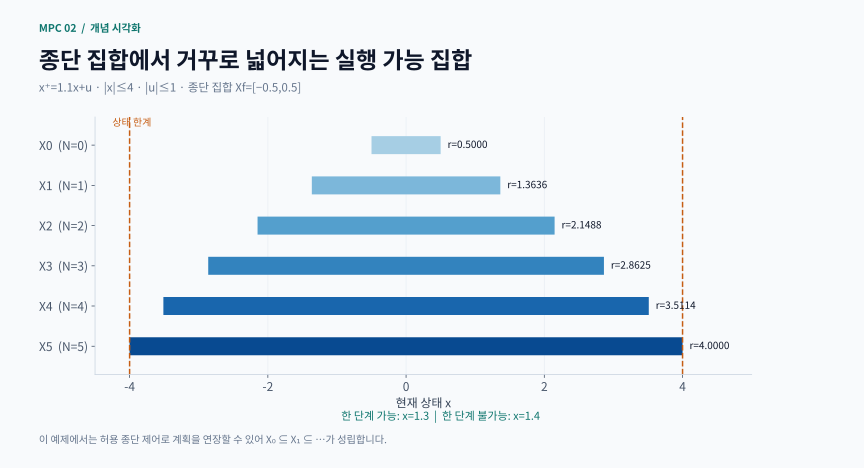
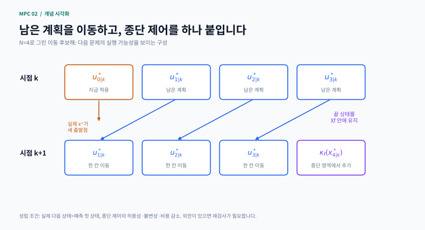

# 2장 · 명목 MPC: 제약과 안정성

이 글은 Rawlings·Mayne·Diehl 교재 2판 1쇄 Chapter 2의 비공식 한국어 학습 노트입니다. 공식 번역이나 전체 증명·해답집이 아닙니다. 작은 명목 MPC 문제를 통해 최적화 문제를 정의하고, 그 문제를 반복해서 풀어도 괜찮은 이유를 조건과 계산으로 확인합니다. 교재 범위는 인쇄 쪽수 89–192입니다.

## 1 이번 장의 핵심 질문

지금 입력을 잘 고르는 것만으로 충분할까요? 제약이 있는 제어에서는 두 질문을 추가해야 합니다. 첫 입력을 적용한 다음에도 다음 최적화 문제를 풀 수 있어야 하고, 이 과정을 계속했을 때 목표에 가까워져야 합니다. 각각 재귀적 실행 가능성과 폐루프 안정성의 문제입니다.

선수 지식은 1장의 이산시간 모델, LQR, Riccati 방정식, 고유값, 이차계획법 QP입니다. 이번 장의 기본 가정은 현재 상태를 정확히 알고 예측 모델과 실제 상태 변화가 일치하는 명목 조건입니다. 외란과 추정 오차가 있는 현장에 그대로 옮겨도 같은 보장을 얻는다는 뜻은 아닙니다.

학습 목표는 네 가지입니다.
- 상태·입력·종단 제약을 포함한 MPC를 정식화한다
- 이전 최적 입력을 이동한 후보해로 다음 문제의 실행 가능성을 설명한다
- 값 함수 감소와 안정성 사이에 필요한 조건을 구분한다
- 비선형·차선·경제적·이산 입력 MPC에서 무엇이 달라지는지 판단한다

## 2 최적화 문제를 정확히 쓰기

현재 상태 x에서 예측 길이 N의 문제는 다음과 같습니다.

$$
\begin{gathered}
V_N(x)=\min_{u_0,\ldots,u_{N-1}}\left\{\sum_{j=0}^{N-1}\ell(x_j,u_j)+V_f(x_N)\right\} \\
x_0=x,\qquad x_{j+1}=f(x_j,u_j) \\
(x_j,u_j)\in Z,\qquad x_N\in X_f
\end{gathered}
$$

ℓ은 단계 비용, V𝒻는 종단 비용, Z는 허용 상태·입력 쌍의 집합, X𝒻는 종단 집합입니다. Vₙ(x)는 최적 비용이며 특정 입력 열의 비용과 구분합니다. 최적 입력 열의 첫 항만 적용한 뒤 다음 상태에서 다시 풉니다.

Xₙ은 적어도 하나의 실행 가능한 입력 열이 존재하는 초기상태의 집합입니다. x가 Xₙ 밖에 있으면 가중치를 예쁘게 조정해도 현재 문제의 해는 생기지 않습니다. 제약 또는 목표·예측 길이의 설계를 다시 검토해야 합니다.

해의 존재, 유일성, 제어법의 연속성은 서로 다른 성질입니다. 연속인 비용을 비어 있지 않은 콤팩트 집합에서 최소화하면 최솟값이 존재합니다. 볼록 집합 위의 엄격한 볼록성은 유일성을 줄 수 있습니다. 그러나 비선형 모델의 매끄러운 식만 보고 상태 변화에 따라 최적 입력도 매끄럽다고 단정하면 안 됩니다. 실행 가능한 입력 집합 자체가 갈라지거나 변할 수 있습니다.

## 3 손으로 푸는 제약 QP 예제

교재 모델 재계산: Rawlings·Mayne·Diehl (2017), 예제 2.5–2.6, 인쇄 pp.99–104와 그림 2.2의 모델을 사용합니다. 아래 x=2.25도 원전에서 사용된 값이며 새로 발명한 모델이나 수치라고 주장하지 않습니다. 설명과 계산 과정은 학습 목적에 맞게 새로 구성했습니다. [원전의 판본 안내](https://sites.engineering.ucsb.edu/~jbraw/mpc/) 정규화한 스칼라 상태 x와 입력 u에 대해 x⁺ = x + u, N = 2, |u₀|, |u₁| ≤ 1이고 상태·종단 제약은 없습니다. 비용은

J = ½(x₀² + x₁² + x₂² + u₀² + u₁²)

입니다. x₁ = x + u₀, x₂ = x + u₀ + u₁을 대입하고 U = [u₀,u₁]ᵀ로 쓰면

J = 1.5x² + [2x,x]U + ½UᵀHU

H = [[3,1],[1,2]]

를 얻습니다. H의 비대각 항 때문에 두 입력의 선택은 서로 연결됩니다. 무제약 미분 조건 HU + [2x,x]ᵀ = 0은 U = [−0.6x,−0.2x]ᵀ를 줍니다.

x = 2.25이면 무제약 해는 [−1.35,−0.45]라서 첫 입력 한계를 넘습니다. 성분별로 잘라 내면 [−1,−0.45]가 되지만 이것은 최적 입력 열이 아닙니다. 첫 입력을 −1로 고정한 뒤 둘째 입력의 미분 조건을 다시 풀면

u₁ = −(x + u₀)/2 = −0.625

입니다. 진짜 제약 해는 [−1,−0.625], 상태 열은 [2.25,1.25,0.625]입니다. 최적 비용은 4.203125이며 잘라 낸 입력 열의 비용은 4.23375입니다. 손실은 0.030625입니다. 두 방법의 첫 입력이 같아도 전체 계획이 최적인 것은 아니라는 점이 중요합니다.

일반적으로 x ≥ 0에서는 x ≤ 5/3이면 두 입력 모두 비활성 제약, 5/3 ≤ x ≤ 3이면 첫 입력만 −1, x ≥ 3이면 두 입력 모두 −1입니다. 활성 제약이 바뀌는 경계에서 최적 입력의 식도 바뀝니다.

## 4 실행 가능 집합을 거꾸로 구하기

종단 집합에 들어갈 수 있는 상태부터 역방향으로 생각하면 실행 가능 집합을 구성할 수 있습니다. 한 단계 전임 집합 Pre(S)는 허용 입력 하나를 선택하여 다음 상태를 S에 넣을 수 있는 현재 상태들의 집합입니다.

$$
\begin{gathered}
X_0=X_f \\
X_{j+1}=\{x:\ \exists u,\ (x,u)\in Z,\ f(x,u)\in X_j\}
\end{gathered}
$$

스칼라 보충 모델 x⁺ = 1.1x + u, |x| ≤ 4, |u| ≤ 1, X𝒻 = [−0.5,0.5]에서는 대칭 구간의 반경만 추적할 수 있습니다.

$$
r_0=0.5,\qquad r_{j+1}=\min\left(4,\frac{r_j+1}{1.1}\right)
$$

따라서 r₁ ≈ 1.3636입니다. x = 1.3은 한 단계 안에 종단 집합에 넣을 수 있지만 x = 1.4는 안 됩니다. 단순한 해석식을 QP의 실행 가능 판정과 대조하면 구현의 부호와 경계 처리를 검사하기 좋습니다.

종단 집합이 적절한 허용 제어 아래 불변이면 기존 계획 끝에 제어를 하나 더 붙일 수 있어 Xₙ ⊆ Xₙ₊₁을 얻습니다. 예측 길이가 늘면 항상 어떤 조건 없이 이런 포함 관계가 성립한다고 외우지 말고, 끝에 무엇을 붙이는지를 설명해 보세요.

보충 계산 시각화 · 예측 길이에 따라 넓어지는 스칼라 실행 가능 집합

반경은 r₀=0.5, rₙ₊₁=min(4,(rₙ+1)/1.1)입니다. 한 단계 집합의 경계 1.3636이 x=1.3과 x=1.4를 구분합니다.

[PNG로 크게 보기](../../docs/assets/diagrams/ch02_feasible_sets.png)

## 5 안정성 증명의 중심 이동 후보해

종단 영역 X𝒻에서 사용할 제어 κ𝒻(x)를 설계합니다. 모든 x ∈ X𝒻에 대해 다음을 확인하는 것이 표준적인 출발점입니다.

1. (x,κ𝒻(x))가 상태·입력 제약을 지킨다
2. f(x,κ𝒻(x)) ∈ X𝒻이다
3. V𝒻(f(x,κ𝒻(x))) − V𝒻(x) ≤ −ℓ(x,κ𝒻(x))이다

현재 최적 입력 열이 (u₀*,u₁*,…,uₙ₋₁*)이고 종단 상태가 xₙ*라고 합시다. 첫 입력 뒤에는 남은 열을 한 칸 이동하고 끝에 κ𝒻(xₙ*)를 붙입니다. 이 후보가 다음 문제에 실행 가능하면 다음 최적 비용은 후보 비용보다 크지 않습니다. 앞 비용 항 하나는 사라지고 마지막 항은 종단 감소 조건으로 상쇄되므로

$$
V_N(x^+)-V_N(x)\leq-\ell(x,u_0^*)
$$

를 얻습니다. 이것이 재귀적 실행 가능성과 비용 감소를 연결하는 핵심입니다. 실제 x⁺가 예측 첫 상태와 같다는 명목 가정이 증명의 어느 지점에 쓰이는지도 표시하세요.

외란이 들어와 같은 이동 후보가 제약을 깨더라도 다음 MPC 문제 전체가 불가능하다는 뜻은 아닙니다. 다른 입력 열로 다시 최적화하면 실행 가능할 수 있습니다. 후보 증명의 실패, 최적화 문제의 불가능성, 폐루프 불안정성은 각각 별도의 판정입니다.

직접 제작한 개념 도식 · 이전 최적 입력을 이동해 다음 후보를 만드는 과정

처음 적용한 입력을 버리고 나머지를 옮긴 뒤 종단 정책을 붙입니다. 이 후보가 다음 문제에 허용되면 다음 최적 비용은 후보 비용보다 크지 않습니다.

[PNG로 크게 보기](../../docs/assets/diagrams/ch02_shifted_candidate.png)

## 6 비용이 줄면 상태도 줄어드는가

비용이 상태의 크기를 적절히 나타내야 합니다. 예를 들어 같은 영역에서 양의 상수 c₁,c₂,c₃에 대해

c₁||x||² ≤ V(x) ≤ c₂||x||²
V(x⁺) − V(x) ≤ −c₃||x||²

이면 V(xₖ) ≤ (1 − c₃/c₂)ᵏV(x₀) 같은 감쇠 상한을 얻습니다. 상태 크기의 상한에는 제곱근이 붙으므로 비용의 감쇠율과 상태 노름의 감쇠율을 혼동하지 마세요. 해당 상수와 부등식이 적용되는 영역 안에서의 결론입니다.

출력 y에만 비용을 부과하면 보이지 않는 상태가 발산할 수 있습니다. A = diag(1.2,0.7), B = [0,1]ᵀ, C = [0,1] 예제에서는 두 번째 상태는 조절되어도 첫 번째 상태는 1.2ᵏ로 커집니다. 출력 비용 감소로 전체 상태 수렴을 결론 내리려면 검출가능성 등 빠진 조건을 확인해야 합니다.

## 7 모델 유형별 종단 설계

무제약 선형 LQ에서는 안정화 DARE 해 P를 V𝒻(x) = xᵀPx에 쓰면 유한 구간 MPC의 첫 입력이 무한 구간 LQR과 일치합니다. 여기서는 보충 실습의 관례대로 비용의 공통 ½를 생략합니다. 모든 감소 검사에서도 같은 정의를 유지해야 합니다.

상태·입력 제약이 있으면 κ𝒻(x) = Kx가 실제로 허용되는 영역이 필요합니다. u = Kx 관례이므로 K에는 음의 부호가 들어 있습니다. 스칼라 x⁺ = ax + bu에서 |a + bK| < 1이고 상태·입력 한계가 각각 xₘₐₓ,uₘₐₓ이면 대칭 종단 구간의 고정 K 최대 허용 반경은

ρₘₐₓ = min(xₘₐₓ, uₘₐₓ/|K|)

입니다. 비용 감소 식이 모든 x에서 성립해도 |Kx|가 입력 한계를 넘을 수 있습니다. 종단 집합을 무조건 키워 실행 가능 영역을 넓히려 하면 이 연결 고리가 끊깁니다. 다변수에서는 상태 제약과 입력 제약을 포함한 집합에 대해 다음 상태도 내부에 남는지 반복 검사할 수 있습니다. 고정 피드백의 최대 허용 불변 집합과 임의 입력을 선택할 수 있는 최대 제어 불변 집합은 다릅니다.

주기 시스템에서는 현재 위상뿐 아니라 예측 종료 시점의 위상에 맞는 종단 비용을 선택합니다. 비선형 시스템에서는 국소 최적화가 전역 최적해를 보장하지 않으므로 솔버 성공 표시와 실제 제약 잔차를 별도로 확인합니다. 시변 비선형 모델은 구간의 각 단계에 해당 시간의 모델을 써야 합니다.

종단 집합이 모든 MPC에 절대적으로 필수인 것은 아닙니다. 적절한 종단 비용이나 충분한 예측 길이 등 다른 조건으로 안정성을 얻는 구성도 있습니다. 다만 종단 제약을 삭제하는 것과 그 삭제 후의 안정성을 보이는 것은 다른 작업입니다.

## 8 최적해를 끝까지 못 구하는 차선 MPC

실시간 계산에서는 매번 전역 최적해를 얻기 어려울 수 있습니다. 중요한 대안은 실행 가능한 이동 후보를 보관하고, 새 계산 결과가 실행 가능하면서 후보보다 비용이 크지 않을 때만 받아들이는 방식입니다. 계산 시간이 끝났다는 이유만으로 아직 제약을 어기는 반복점을 적용해서는 안 됩니다.

이 경우 제어 결정에는 현재 공정 상태와 저장된 입력 열이 함께 쓰입니다. 같은 x라도 저장 후보가 다르면 다음 입력이 다를 수 있으므로 분석에서는 둘을 묶은 확장 상태를 사용합니다. 안정성 보장은 선택 가능한 해들 중 우연히 좋은 한 경로만이 아니라 수락 규칙이 허용하는 선택을 다뤄야 합니다.

## 9 경제적 MPC와 비용 변환

조절 MPC의 비용은 보통 목표와의 거리를 벌점화합니다. 경제적 MPC는 생산 수익, 에너지 비용 같은 운전 목적 자체를 최소화하며 단계 비용이 음수일 수도 있습니다. 가장 경제적인 정상상태는 xₛ = f(xₛ,uₛ)를 만족하는 허용 점 중 ℓ이 최소인 점입니다. 경제적 평균 성능이 좋다는 결론과 상태가 이 정상상태로 수렴한다는 결론을 구분해야 합니다.

저장 함수 λ를 이용해 다음 변환 비용을 생각합니다.

$$
L(x,u)=\ell(x,u)-\ell(x_s,u_s)+\lambda(x)-\lambda(f(x,u))
$$

엄격한 소산성은 이 변환 비용이 목표로부터의 편차를 아래에서 제한하도록 해 주는 조건이며, 추가 가정과 함께 안정성 분석에 쓰입니다. 단순히 λ라는 함수를 하나 쓴다고 성립하지는 않습니다.

보충 모델 x⁺ = 0.8x + 0.2u, ℓ = 0.5x² + 0.2u² − 2.8x에서는 정상 조건 x = u로부터 (xₛ,uₛ) = (2,2), ℓₛ = −2.8을 얻습니다. λ(x) = 4x를 넣으면 L = 0.5(x − 2)² + 0.2(u − 2)²입니다. 이 특수 예제는 경제 비용이 변환 뒤 양의 추종 비용이 되는 계산을 보여 줍니다.

구간 전체를 더하면 ΣL = Σℓ − Nℓₛ + λ(x₀) − λ(xₙ)입니다. xₙ이 고정이면 마지막 항도 상수라 최적 입력이 유지됩니다. 자유 종단이면 λ(xₙ)이 입력 열에 따라 바뀌므로 같은 문제를 유지하려면 변환 목적함수에 +λ(xₙ)을 보정해야 합니다.

## 10 이산 입력은 반올림으로 끝나지 않는다

입력이 장치 켜짐·꺼짐이나 장비 대수라면 연속값이 아니라 유한 집합에 속합니다. 세 값 중 하나를 매 단계 선택하면 길이 N의 입력 열은 3ᴺ개입니다. N을 5에서 8로 늘리는 것만으로 전수 탐색 후보가 27배가 됩니다.

다음 반례를 보세요: x⁺ = 0.8x + u, u ∈ {−1,0,1}, N = 1, x₀ = 0.64, |x₁| ≤ 0.5입니다. 연속 완화 최적 입력 약 −0.494를 0으로 반올림하면 x₁ = 0.512라 종단 상한을 넘습니다. 입력 −1은 x₁ = −0.488로 실행 가능합니다. 완화 문제의 최적 비용은 원래 이산 문제의 하한으로 쓸 수 있지만 반올림 해의 실행 가능성은 따로 검사해야 합니다.

## 11 학습용 보충 문제와 확인 기준

1. QP 기하: x = 2.25에서 두 입력 열의 상태와 비용을 직접 계산하세요. 힌트: 첫 입력을 고정한 후 둘째 입력을 다시 최소화합니다.
2. 실행 가능성: r₀ = 0.5에서 r₁,r₂,r₃을 계산하고 경계 안팎의 QP 결과를 비교하세요. 힌트: 수치 허용오차 때문에 경계와 아주 가까운 점은 따로 다룹니다.
3. 종단 설계: 종단 집합 반경을 20% 넓히기 전에 입력 한계 위반을 예측하세요. 힌트: 입력 한계가 활성인 경계에서는 20% 확대가 한계의 20%만큼 초과를 만듭니다. 기본 uₘₐₓ = 1이면 0.2입니다.
4. 이동 후보: 실제 다음 상태에만 외란을 넣고 후보의 제약 위반과 재최적화 결과를 별도로 기록하세요. 힌트: 두 실패는 동치가 아닙니다.
5. 경제 비용: λ(x) = 4x를 대입해 항들을 전개한 뒤 자유 종단 보정의 부호를 확인하세요. 힌트: 합에서 −λ(xₙ)이 남으므로 보정은 플러스입니다.
6. 차선 제어: 후보의 실행 가능 검사와 비용 수락 검사를 각각 제거하면 무엇을 보장할 수 없는지 설명하세요. 힌트: 최적화 반복 횟수 자체는 안정성 조건이 아닙니다.

완료 기준: 현재 문제의 실행 가능성, 다음 문제의 실행 가능성, 비용 감소, 상태 수렴을 각각 구분하고 한 조건이 다른 조건을 뒷받침하는 이유를 설명할 수 있어야 합니다.

## 12 원문과 실행 자료

- [저자 공식 교재 페이지](https://sites.engineering.ucsb.edu/~jbraw/mpc/)
- [교재 2판 1쇄 공식 PDF](https://sites.engineering.ucsb.edu/~jbraw/mpc/MPC-book-2nd-edition-1st-printing.pdf)

이 사이트의 개념 도식과 수식 카드는 본문의 모델·수치로 새로 제작했습니다. 교재에서 가져온 모델·예제는 해당 문단에 출처를 표시합니다. 각 장의 독립 실행 예제는 명시된 작은 보충 문제를 다루며, 교재의 모든 계산이나 증명을 재현하는 구현은 아닙니다. 수치 결과는 모델, 정보 시점, 잡음 가정과 허용오차를 함께 확인해 주세요.

## 핵심 수식 카드

일반 수학·제어식을 새로 조판한 복습 카드입니다. 성립 가정은 각 카드와 본문을 함께 확인하세요.

- **명목 MPC의 최적화 문제**: 상태·입력·종단 제약을 포함한 명목 MPC 문제
- **실행 가능 집합을 뒤에서부터 계산**: 전임 집합 재귀와 스칼라 실행 가능 반경의 손계산
- **종단 감소에서 MPC 값 함수 감소로**: 종단 불변성·감소 조건과 이동 후보가 만드는 값 함수 감소
- **경제적 비용을 변환할 때 남는 종단 항**: 경제 비용의 회전 변환과 자유 종단 보정의 부호

## 관련 영상

[MPC for Renewable Energy Systems: Lecture 9 - Part 1 — Feasibility and Stability of Model Predictive Control](https://www.videoportal.uni-freiburg.de/video/mpc-for-renewable-energy-systems-lecture-9-part-1/185/f6a55e6dc76b7381da027d0cdacd6436)

제공: University of Freiburg · Jochem De Schutter

최적화 문제를 한 번 푸는 것과 매 시점 계속 풀 수 있는 것의 차이에 주목한다. 재귀적 실행 가능성과 폐루프 안정성을 교재의 terminal cost/set 조건과 연결해 읽는다. 다른 강좌의 보조 강의다.

[영상 제공 기관의 안내](https://www.videoportal.uni-freiburg.de/video/mpc-for-renewable-energy-systems-lecture-9-part-1/185/f6a55e6dc76b7381da027d0cdacd6436)

교재의 공식 장별 강의가 아닌 보조 자료입니다. 제목·설명으로 관련성을 확인했으며 전체 시청 검증은 아닙니다.
