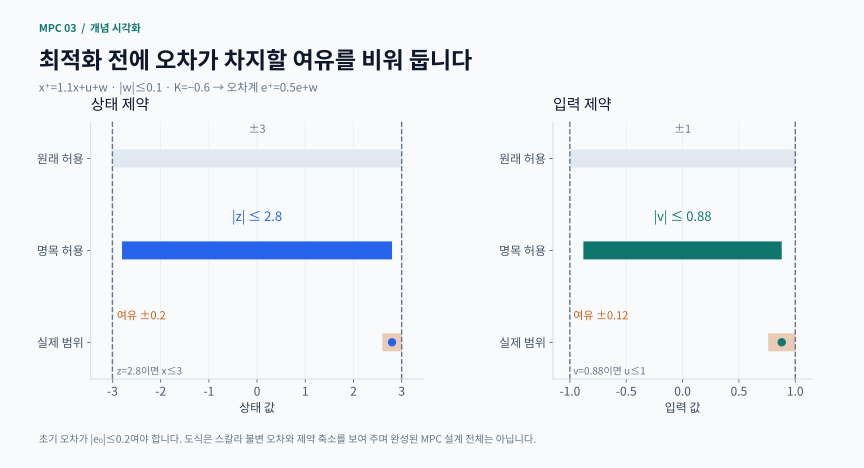
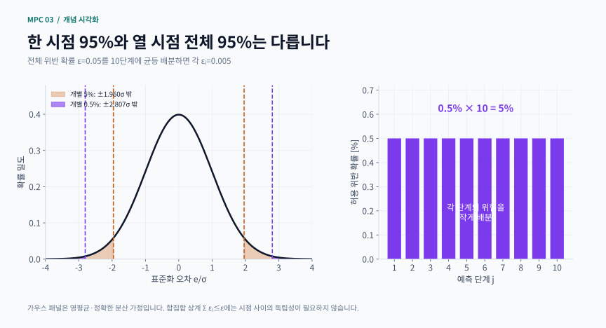

# 3장 · 강인·확률적 MPC

이 장의 질문은 “예측이 빗나가도 무엇을 보장할 수 있는가?”입니다. 명목 궤적 하나를 잘 만드는 것에서 출발해, 가능한 궤적 전체를 감싸는 튜브와 허용 위반 확률을 설계하는 방법으로 확장합니다. Rawlings·Mayne·Diehl 교재 2판 1쇄 제3장을 따라 읽는 비공식 한국어 학습 해설입니다. 원문 전체 번역이나 정리의 모든 가정을 대체하는 자료는 아닙니다.

## 학습 목표와 읽는 순서

- 개방루프 입력 열과 인과적 피드백 정책의 차이를 설명합니다
- 불변 오차 집합으로 상태·입력 제약을 얼마나 줄여야 하는지 계산합니다
- 강인 보장, 확률 제약, 표본 설계의 신뢰도, 검증 빈도를 구분합니다
- 시뮬레이션 성공과 모든 허용 외란에 대한 증명을 구분합니다

선수 지식: 2장의 재귀적 실행 가능성, 종단 비용·종단 집합, 선형 상태공간 모델, 기본 확률과 분산. 행렬이 부담스럽다면 먼저 아래 스칼라 계산을 끝낸 뒤 집합 표현으로 돌아오세요.

학습 경로: ① 불확실성과 정보 순서 → ② 명목 강인성 → ③ 최소–최대 문제 → ④ 튜브 계산 → ⑤ 비선형 확장 → ⑥ 확률·표본 해석 → ⑦ 실습과 자가 점검.

## 1 불확실성과 정보 순서

실제 모델을 xₖ₊₁ = Axₖ + Buₖ + wₖ로 놓습니다. x는 상태, u는 조작 입력, w는 모델에 포함하지 못한 가산 외란입니다. 센서 잡음, 계수 오차, 미모델링 동역학을 모두 같은 w라고 부르면 편리하지만, 그 오차가 선택한 집합 W 안에 정말 들어오는지 별도로 확인해야 합니다.

강인 MPC는 w₀,…,wₙ₋₁ ∈ W인 모든 허용 경로를 대상으로 합니다. 확률적 MPC는 특정 분포에서 뽑힌 경로를 대상으로 비용의 기대값이나 위반 확률을 다룹니다. 유계라는 정보와 분포를 안다는 정보는 서로 대체되지 않습니다. 가우스 잡음은 확률이 작더라도 임의로 큰 값이 나올 수 있으므로, 유계 잡음용 강제약 증명을 그대로 붙일 수 없습니다.

입력 열 (u₀,u₁,…)은 미리 정한 숫자입니다. 정책 π는 “그때까지 관측한 상태가 이러하면 이 입력을 쓰라”는 규칙입니다. 실제 MPC는 매번 다시 풀지만, 예측 구간 안에서 미래 피드백을 어떻게 표현했는지도 중요합니다. 같은 과거를 가진 시나리오들은 같은 입력을 사용해야 합니다. 이를 비예견성이라고 합니다.

손으로 확인: x⁺ = u+w, u,w ∈ {−1,1}, 비용 (x⁺)²를 생각해 보세요. u를 먼저 정하면 외란은 같은 부호를 골라 비용을 4로 만듭니다. 따라서 minᵤ max𝑤 비용은 4입니다. 외란을 먼저 보고 u=−w를 고르는 max𝑤 minᵤ 문제의 값은 0입니다. 두 순서를 바꾸는 것은 계산 편의가 아니라 허용 정보의 변경입니다.

## 2 명목 안정성만으로 부족한 이유

외란 없는 폐루프가 원점으로 수렴해도 제약 경계에 너무 가까운 계획은 작은 외란 한 번에 위반될 수 있습니다. 불연속 제어법에서는 작은 상태 변화가 큰 입력 변화로 이어질 수도 있습니다. 명목 MPC의 내재적 강인성을 논하려면 연속성, 값 함수 감소, 제약 여유 등 해당 결과의 가정을 함께 봐야 합니다.

직관을 주는 스칼라 오차계는 eₖ₊₁ = ρeₖ+wₖ입니다. |ρ|<1, |wₖ|≤w̄이면 반복 대입과 삼각부등식으로 다음을 얻습니다.

$$
|e_k|\leq |\rho|^k|e_0|+\bar{w}\frac{1-|\rho|^k}{1-|\rho|}
$$

첫 항은 초기 오차의 흔적이고 두 번째 항은 계속 들어오는 외란의 누적 영향입니다. 시간이 지나도 외란이 사라지지 않으면 잔여 반경 s=w̄/(1−|ρ|)가 남습니다. “안정하다”는 표현이 원점으로 정확히 수렴한다는 뜻인지, 작은 집합 안에 머문다는 뜻인지 먼저 정해야 합니다. 이 식은 위 스칼라계의 직접 계산이며 일반 MPC 정리 전체를 증명하지는 않습니다.

## 3 최소–최대 제어와 동적 계획법

최소–최대 문제는 각 정책이 허용 외란 중 가장 불리한 경로에서 내는 비용을 평가합니다. 피드백을 포함한 벨만 재귀는 다음과 같이 읽습니다.

Vⱼ(x) = minᵤ max𝑤 [ℓ(x,u) + Vⱼ₋₁(f(x,u,w))]

Vⱼ는 j단계가 남은 최악 비용, ℓ은 현재 비용, V₀는 종단 비용입니다. 현재 입력을 고른 뒤 외란이 실현되고, 도달한 다음 상태에서는 다시 입력을 고릅니다. 제약이 있으면 최솟값을 취할 입력도 모든 허용 외란에서 다음 상태가 실행 가능한 영역에 들어가는 입력으로 제한해야 합니다.

정수 상태와 유한 입력·외란을 사용하는 작은 예에서는 이를 정확히 열거할 수 있습니다. 연속 고차원 문제는 정책 공간과 상태 공간 때문에 계산량이 급증합니다. 고정 이득에 조정 가능한 항을 더하거나 특정 정책 계열로 제한하면 계산을 줄일 수 있지만, 그 해를 모든 인과적 정책 중 최적이라고 부를 수는 없습니다. 유한 구간 최악 비용이 작아진 사실도 폐루프 안정성의 독립적인 증명은 아닙니다.

## 4 튜브 MPC의 핵심 구조

튜브 MPC는 명목 계획과 오차 보정을 나눕니다.

$$
\begin{gathered}
z_{k+1}=Az_k+Bv_k,\qquad u_k=v_k+K(x_k-z_k) \\
e_k=x_k-z_k,\qquad e_{k+1}=(A+BK)e_k+w_k
\end{gathered}
$$

z와 v는 외란 없는 명목 상태·입력입니다. K는 오차를 줄이는 보조 피드백 이득입니다. e가 집합 S 안에 있을 때 다음 e도 항상 S에 있으면 S를 강인 양의 불변 집합이라고 합니다.

$$
(A+BK)S\oplus W\subseteq S
$$

⊕는 가능한 두 벡터의 모든 합을 모은 민코프스키 합입니다. 실제 상태 집합은 z⊕S로 둘러싸고, 명목 제약을 X⊖S와 U⊖KS로 줄입니다. ⊖는 “오차를 무엇으로 더해도 원래 집합 안에 남는 중심”을 모으는 차 연산입니다. 일반 집합에서 성분별 숫자를 빼는 연산과 같지는 않습니다.

### 직접 계산하는 튜브 예제

x⁺=1.1x+u+w, |w|≤0.1, |x|≤3, |u|≤1로 놓고 K=−0.6을 선택합니다. 오차계 계수는 1.1−0.6=0.5입니다.

1. s=0.1/(1−0.5)=0.2이므로 |e|≤0.2이면 |e⁺|≤0.5×0.2+0.1=0.2입니다
2. 명목 상태는 |z|≤3−0.2=2.8로 제한합니다
3. 보정 입력의 크기는 |Ke|≤0.6×0.2=0.12이므로 |v|≤0.88로 제한합니다
4. z=1, e=0.2, v=−0.5, w=0.1이면 x=1.2, u=−0.62입니다. 다음 명목 상태는 0.6, 실제 상태는 0.8, 다음 오차는 0.2입니다

이 계산은 왜 경계에서도 오차 튜브가 유지되는지 보여 줍니다. 완성된 MPC에는 초기 상태가 튜브 안에 있다는 조건, 축소 문제의 실행 가능성, 종단 비용·집합과 이동 후보 논리가 추가로 필요합니다. e₀가 S 밖에 있는데 같은 반경을 선언하거나 명목 중심을 매번 임의로 실제 상태에 재설정해서는 안 됩니다.

이득을 더 세게 하면 튜브가 작아질 수 있지만 보정 입력도 달라집니다. 예를 들어 K=−1.1이면 오차 계수는 0, s=0.1, |K|s=0.11입니다. 이 비교만으로 전체 제어 성능의 우열이 결정되지는 않습니다. 상태 여유, 입력 여유, 명목 비용, 종단 설계를 함께 평가해야 합니다.

보충 계산 시각화 · 불변 오차 반경이 상태·입력의 명목 허용 범위를 줄이는 방식

상태 여유는 0.2, 입력 여유는 |K|×0.2=0.12입니다. 그래서 명목 한계는 각각 ±2.8, ±0.88이 됩니다. 경계의 명목 중심에서도 모든 허용 오차를 더할 공간을 남깁니다.

[PNG로 크게 보기](../../docs/assets/diagrams/ch03_constraint_tightening.png)

### 집합 근사와 모델 오차의 함정

다차원에서 Sₙ=W⊕AₖW⊕…⊕Aₖⁿ⁻¹W, Aₖ=A+BK를 계산할 수 있습니다. 유한 합은 대개 무한 합의 일부이므로 그대로 불변 외접 집합이라고 부르면 안 됩니다. 수축 관계와 꼬리 상한을 이용해 바깥으로 보정해야 합니다. 교재 예제 3.13(2017, 인쇄 pp.231–233)은 이 보정을 읽을 때 참고할 수 있습니다. 지지 함수를 이용하면 방향별 상한을 계산할 수 있습니다. 여기의 집합 근사 길이는 온라인 MPC 예측 길이와 별개입니다.

실제 계수가 a+Δa이면 오차식에는 Δa·x가 추가됩니다. |x|≤X라는 조건 아래 총 외란 상한은 w̄+|Δa|X입니다. 이 조건부 상한을 얻었다고 설계가 끝나지 않습니다. 커진 튜브를 넣어 축소 제약과 종단 조건이 여전히 성립하는지 다시 확인해야 합니다.

## 5 비선형 튜브로 확장할 때

비선형계에서는 e⁺=f(x,u,w)−f(z,v,0)가 보통 e만의 선형식으로 분리되지 않습니다. 따라서 명목 경로를 추종하는 보조 MPC와 그 값 함수의 부분집합으로 튜브를 구성하는 접근이 등장합니다. 명목 입력에 추종을 위한 여유를 남기는 아이디어는 유지되지만 선형 반경 공식을 무조건 대입할 수 없습니다.

실습의 비선형 보조 MPC는 국소 최적화의 해와 잔차를 확인합니다. 별도로 설계한 상쇄 피드백에 해석적 오차 경계가 있더라도, 그 증명을 다른 보조 MPC 알고리즘의 보장으로 옮기지 마세요. 솔버 성공, 제약 잔차, 국소 최적성, 전역적 안정성은 서로 다른 검사입니다.

## 6 확률 제약에서 반드시 구분할 네 가지

첫째는 새 경로의 위반 확률 ε입니다. P(|eⱼ|>mⱼ)≤εⱼ라는 개별 시점 제약과 P(어느 시점에서든 위반)≤ε라는 구간 제약은 다릅니다. 합집합 상계에 의해 Σⱼεⱼ≤ε로 위험을 배분하면 구간 위험을 제한할 수 있습니다. 이 상계에는 시점 간 독립성이 필요하지 않습니다. 오차는 시간적으로 상관될 수 있으므로 각 시점의 안전 확률을 무조건 곱하지 마세요.

둘째는 분포 가정입니다. e⁺=ρe+w에서 w가 영평균이고 현재 오차와 독립이며 분산이 σw²이면 $\sigma_{j+1}^2=\rho^2\sigma_j^2+\sigma_w^2$입니다. 초기 오차도 가우스이면 선형 변환을 거친 오차는 가우스이고, 양측 여유는 $m_j=\Phi^{-1}(1-\varepsilon_j/2)\sigma_j$입니다. Φ는 표준정규 누적분포 함수입니다. |ρ|<1이면 정상 분산은 σw²/(1−ρ²)지만, 이는 상태가 경로마다 0으로 수렴한다는 뜻이 아닙니다.

셋째는 표본 설계의 실패 확률 β입니다. 한 경로의 최대 절대 오차를 Y로 놓고, 독립·동일분포 경로 M개의 Y 중 최대를 여유로 선택한다고 합시다. Y의 분포가 연속이면 그 설계가 실제 위반 확률 ε를 초과할 확률은 (1−ε)ᴹ입니다. 따라서 이 특별한 최대값 설계에서는 $M\geq\left\lceil\frac{\log\beta}{\log(1-\varepsilon)}\right\rceil$이면 됩니다. ε=0.05, β=0.01일 때 M=90입니다. 일반적인 모든 시나리오 최적화 문제에 이 식을 적용할 수는 없습니다.

넷째는 고정된 설계를 독립 데이터로 검증한 빈도의 불확실성입니다. 100개 독립 경로에서 위반이 0회여도 95% 단측 이항 신뢰상한은 $1-0.05^{1/100}\simeq2.95\%$입니다. 0회 관측과 위반 확률 0은 다릅니다. 같은 설계 데이터를 검증에도 쓰거나 검증 결과를 보고 설계를 고른 뒤 독립 검증이라고 부르면 안 됩니다.

여러 설계를 비교할 때 선택 편향도 생깁니다. 독립 설계 20개 중 가장 작은 여유를 고르면, M=90인 단일 설계의 약 0.99% 실패 확률이 약 18.0%로 커집니다. 각 후보에 β/20을 배분하는 보정에서는 M=149가 필요합니다. 또한 같은 유계 범위라도 외란 분포가 달라지면 확률 여유가 무너질 수 있습니다. 강인 입력 여유를 유지했다는 사실과 확률적 상태 여유가 유효하다는 사실은 따로 점검합니다.

보충 계산 시각화 · 개별 시점의 가우스 여유와 구간 위험 배분

전체 10단계에서 어느 한 번이라도 위반할 확률을 5% 이하로 제한하려면, 균등 배분 예에서는 각 단계가 0.5%를 맡습니다. 필요한 양측 가우스 여유는 1.960σ에서 2.807σ로 커집니다.

적용 범위: 오차가 영평균 가우스이며 각 단계의 분산을 정확히 안다는 조건. 그림의 단계별 막대는 관측 위반 빈도가 아니라 설계 위험 배분.

[PNG로 크게 보기](../../docs/assets/diagrams/ch03_risk_allocation.png)

## 7 실습 순서와 자주 하는 오해

복습할 때는 피드백 비교 → 강인 튜브 → 가우스 여유 → 표본 설계 → 선택 편향 순으로 개념을 연결하세요. 아래 독립 실행 예제는 이 중 튜브의 오차 반경과 가우스 여유를 계산합니다. 각 결과에서 “무엇을 바꾸었고, 어떤 가정이 유지되는가?”를 기록하면 그래프만 보는 것보다 훨씬 효과적입니다.

- “무작위 경로가 모두 안전하니 강인하다”: 불변 집합이나 최악 경우 분석이 필요합니다
- “예측을 길게 하면 불확실성이 사라진다”: 오차 전파와 제약 여유가 달라질 뿐입니다
- “95% 안전이면 20단계도 95% 안전하다”: 개별 사건과 결합 사건을 구분합니다
- “β=1%는 실제 위반율 1%다”: β는 표본 설계가 ε 목표를 놓칠 확률입니다
- “범위가 같으면 확률 보장도 같다”: 분포 변화는 확률 제약에 영향을 줍니다

## 8 학습용 보충 문제와 힌트

1. 스칼라 튜브 예제에서 외란 상한을 0.15로 바꾸면 s와 명목 제약은? 힌트: K는 고정하고 s부터 계산합니다. s=0.3, |z|≤2.7, |v|≤0.82입니다
2. e₀=0.5를 위의 s=0.2 튜브로 바로 보장할 수 있나요? 힌트: 초기 포함 조건과 시간이 지난 뒤의 오차 상한은 다릅니다
3. 10단계 전체 위반 확률을 5% 이하로 제한하려면 균등 위험 배분은? 힌트: 각 시점 εⱼ=0.005로 두고 양측 가우스 분위수를 계산합니다
4. 100회 무위반과 1,000회 무위반 중 어느 검증이 더 강한가요? 힌트: 같은 95% 단측 상한에서 후자는 약 0.30%입니다
5. 최소–최대 예제의 u를 연속 구간 [−1,1]로 바꾸면 값은? 힌트: u=0을 고려하면 최악 비용 1을 얻습니다. 입력 집합 변경이 답을 바꿉니다
6. 모델 오차 Δa를 두 배로 하면 기존 시뮬레이션을 그대로 보장이라고 쓸 수 있나요? 힌트: 외란 포함, 입력 여유, 종단 조건을 다시 검사합니다

## 출처와 실행 범위

- [저자 공식 교재 페이지](https://sites.engineering.ucsb.edu/~jbraw/mpc/)와 [2판 1쇄 원문 PDF](https://sites.engineering.ucsb.edu/~jbraw/mpc/MPC-book-2nd-edition-1st-printing.pdf): 제3장, 인쇄 pp.193–268
이 사이트의 개념 도식과 수식 카드는 본문의 모델·수치로 새로 제작했습니다. 교재에서 가져온 모델·예제는 해당 문단에 출처를 표시합니다. 각 장의 독립 실행 예제는 명시된 작은 보충 문제를 다루며, 교재의 모든 계산이나 증명을 재현하는 구현은 아닙니다. 수치 결과는 모델, 정보 시점, 잡음 가정과 허용오차를 함께 확인해 주세요.

## 핵심 수식 카드

일반 수학·제어식을 새로 조판한 복습 카드입니다. 성립 가정은 각 카드와 본문을 함께 확인하세요.

- **유계 외란이 남기는 잔여 오차**: 스칼라 안정 오차계의 순간 상한과 불변 반경
- **튜브 MPC: 오차 불변성과 제약 축소**: 실제 상태를 명목 중심과 불변 오차 집합으로 감싸는 튜브 구조
- **가우스 여유와 구간 전체 위험 배분**: 개별 시점 양측 가우스 제약과 전체 예측 구간의 위험 한도
- **표본 설계 신뢰도와 무위반 검증**: 실제 위반율 ε, 설계 실패확률 β, 검증 신뢰상한을 구별

## 관련 영상

[6.8210 Spring 2024 Lecture 21: Robust Control & Policy Search](https://www.youtube.com/watch?v=eEOmmpA1GAw)

제공: MIT Underactuated Robotics · Russ Tedrake / underactuated

불확실성을 확률분포 또는 최악의 경우로 다루는 관점 차이를 살펴본다. Robust control의 배경을 보완하는 영상이며, 교재의 stochastic/tube MPC 전체 전개를 대체하지 않는다.

[영상 제공 기관의 안내](https://underactuated.csail.mit.edu/Spring2024/schedule.html)

교재의 공식 장별 강의가 아닌 보조 자료입니다. 제목·설명으로 관련성을 확인했으며 전체 시청 검증은 아닙니다.
