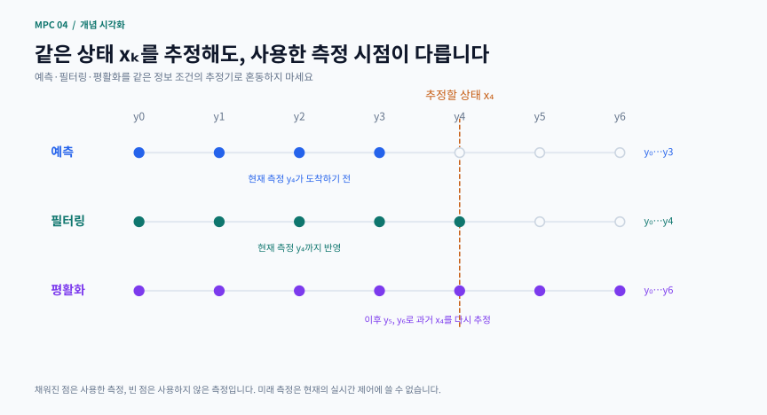
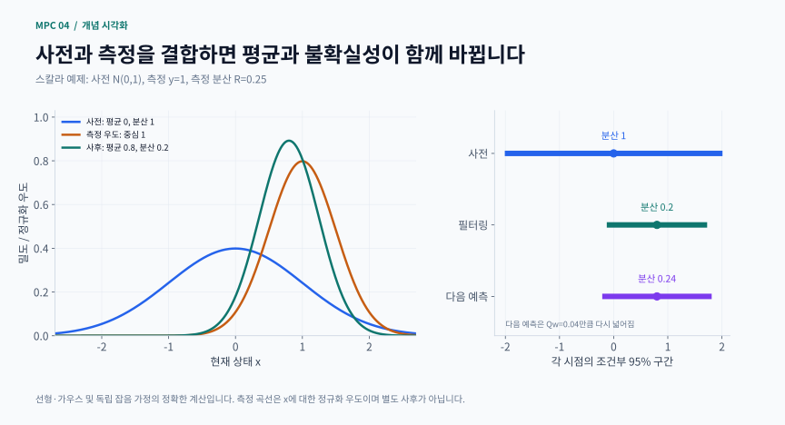

# 4장 · 상태 추정과 MHE

MPC는 현재 상태에서 미래를 예측합니다. 하지만 실제 센서는 위치·온도·압력처럼 상태의 일부만 잡음과 함께 측정합니다. 이 장은 측정 이력과 모델을 결합해 현재 상태를 추정하고, 그 추정의 불확실성을 제어기에 전달하는 방법을 다룹니다. Rawlings·Mayne·Diehl 교재 2판 1쇄 제4장을 위한 비공식 한국어 학습 해설이며, 원문 전체 번역이나 모든 정리의 대체물은 아닙니다.

## 학습 목표와 읽는 순서

- 예측·필터링·평활화가 사용하는 정보의 시간 범위를 구분합니다
- 전체 정보 추정 FIE와 이동 구간 추정 MHE의 목적함수를 구성합니다
- 도착 비용이 과거 정보를 어떻게 보존하는지 설명합니다
- 추정 평균의 정확도와 보고된 공분산의 신뢰성을 따로 검사합니다
- 추정값을 MPC에 넣을 때 실제 입력 이력과 추정 오차가 왜 중요한지 이해합니다

선수 지식: 선형 상태공간 모델, 최소제곱, 공분산, 조건부 확률, 기초 관측가능성. 3장의 강인·확률 보장을 먼저 구분해 두면 “추정 구간 안에 실제 상태가 있다”는 말을 정확히 읽을 수 있습니다.

학습 경로: ① 정보 시점 → ② FIE와 칼만 필터 → ③ 관측가능성·검출가능성 → ④ MHE와 도착 비용 → ⑤ 제약과 유계 잡음 → ⑥ 비선형 추정기 → ⑦ 불확실성 검증 → ⑧ MPC 결합.

## 1 같은 상태라도 사용할 수 있는 정보가 다릅니다

기본 모델은 xₖ₊₁=Axₖ+Buₖ+wₖ, yₖ=Cxₖ+vₖ입니다. x는 보이지 않는 상태, y는 측정, u는 실제로 적용한 알려진 입력입니다. w는 과정 잡음, v는 측정 잡음입니다. 과정 잡음은 실제 상태 변화에 들어가고 측정 잡음은 센서 값에 들어가므로 두 항의 역할을 분리해야 합니다.

- 예측 mₖ⁻: y₀,…,yₖ₋₁만으로 xₖ를 추정합니다
- 필터링 mₖ⁺: 현재 측정 yₖ까지 사용해 xₖ를 추정합니다
- 평활화 mₖ|T: T>k인 미래 측정까지 사용해 과거 xₖ를 다시 추정합니다

실시간 제어에서는 아직 도착하지 않은 미래 측정을 사용할 수 없습니다. 오프라인 평활화 결과가 필터링보다 좋아 보이더라도 서로 같은 정보 조건의 비교는 아닙니다. 예를 들어 y₀,…,yT₋₁로 xT를 추정하면 예측형이고, yT까지 반영하면 필터링형입니다. 비교할 때는 어떤 측정까지 사용했는지 먼저 표시하세요.

스스로 확인할 실험: 데이터에서 yₖ 하나만 바꾸세요. 같은 시점 예측 mₖ⁻는 바뀌면 안 되고 필터링 mₖ⁺는 바로 바뀔 수 있습니다. 이 검사는 정보의 시간 경계를 확인하며, 센서 고장과 실제 상태 변화를 구분하는 고장 진단 자체는 아닙니다.

직접 제작한 개념 도식 · 예측·필터링·평활화가 사용하는 정보의 시간 경계

세 행은 모두 x₄를 대상으로 하지만 예측은 y₃까지, 필터링은 y₄까지, 평활화는 예시의 미래 y₆까지 사용합니다. 같은 시점의 추정 오차를 비교해도 정보 조건은 다릅니다.

[PNG로 크게 보기](../../docs/assets/diagrams/ch04_information_timeline.png)

## 2 전체 정보 추정과 칼만 필터

FIE는 초기 사전 정보와 지금까지의 모든 측정을 함께 설명하는 상태 경로를 찾습니다. 상태 후보를 ξ로 쓰면 선형 예측형 문제의 비용은 다음과 같습니다.

$$
\begin{gathered}
J=\|\xi_0-m_0\|_{P_0^{-1}}^2 \\
\quad+\sum_{j=0}^{T-1}\left[\|\xi_{j+1}-A\xi_j-Bu_j\|_{Q_w^{-1}}^2+\|y_j-C\xi_j\|_{R_v^{-1}}^2\right]
\end{gathered}
$$

‖r‖²(M)는 rᵀMr를 뜻합니다. P₀는 초기 상태의 사전 공분산, Qw와 Rv는 과정·측정 잡음 공분산입니다. 공분산이 작다고 가정한 잔차는 더 크게 벌점화됩니다. 상관이 있는 공분산에서는 각 성분의 분산으로 나누는 것만으로 충분하지 않습니다. 수치 구현에서는 Cholesky 분해로 잔차를 백색화해 계산할 수 있습니다.

선형 모델, 가우스 초기 사전, 서로 독립인 백색 가우스 과정·측정 잡음, 정확한 공분산, 상태 제약 없음이라는 조건에서는 전체 상태 경로의 사후 분포가 가우스입니다. 이때 최소제곱의 최빈 경로와 평균 경로가 일치하고, 끝 상태의 결과는 같은 정보 시점을 사용하는 칼만 추정과 일치합니다. 비선형·제약 문제에서는 최빈값과 조건부 평균이 일반적으로 다릅니다.

칼만 필터는 이 선형 정보를 재귀적으로 갱신합니다. 예측 평균·공분산을 m⁻,P⁻라고 할 때:

$$
\begin{gathered}
S=CP^-C^T+R_v,\qquad L=P^-C^TS^{-1} \\
m^+=m^-+L(y-Cm^-) \\
P^+=(I-LC)P^-(I-LC)^T+LR_vL^T \\
m_{k+1}^-=Am_k^++Bu_k,\qquad P_{k+1}^-=AP_k^+A^T+Q_w
\end{gathered}
$$

S는 혁신 y−Cm⁻의 공분산, L은 측정 갱신 이득입니다. P⁺는 수치적으로 안정적인 Joseph 형태를 적었습니다. 이론의 역행렬 표기와 실제 구현에서 역행렬을 직접 만드는 것은 다릅니다. 구현은 선형계 풀이를 우선합니다.

### 손으로 푸는 한 단계 예제

보충 예제로 x⁺=x+w, y=x+v, 현재 사전 m⁻=0, P⁻=1, Rv=0.25, Qw=0.04를 놓고 측정 y=1을 받습니다.

1. 혁신 분산은 S=1+0.25=1.25입니다
2. L=1/1.25=0.8이므로 필터링 평균은 m⁺=0+0.8×1=0.8입니다
3. 필터링 분산은 P⁺=(1−0.8)²×1+0.8²×0.25=0.2입니다
4. 입력이 없다면 다음 예측은 m다음⁻=0.8, P다음⁻=0.2+0.04=0.24입니다

현재 측정을 그대로 믿는 값 1과 사전 값 0 사이에서, 불확실성에 따라 가중 평균을 잡은 것입니다. 정확한 가우스 가정 아래 현재 상태의 조건부 95% 구간은 약 0.8±1.96√0.2입니다. 분산이 작다는 이유만으로 가정이 틀린 추정기의 구간도 정확하다고 믿을 수는 없습니다.

보충 계산 시각화 · 측정 한 번이 평균을 이동시키고 분산을 줄이는 과정

칼만 이득 0.8은 사전 평균 0을 측정값 1 쪽으로 옮겨 사후 평균 0.8을 만듭니다. 분산은 1→0.2로 줄지만 다음 예측에서는 과정 잡음 때문에 0.24가 됩니다.

[PNG로 크게 보기](../../docs/assets/diagrams/ch04_kalman_update.png)

## 3 관측가능성과 검출가능성

관측가능성은 유한 측정 이력으로 초기 상태를 구별할 수 있는지를 묻습니다. 과정 외란 없는 선형계에서 관측가능성 행렬 Oₙ=[C; CA; …; CAⁿ⁻¹]의 열 랭크가 상태 차원과 같으면 초기 상태를 유일하게 복원할 수 있습니다. 실제 잡음이 있으면 랭크뿐 아니라 수치 조건과 측정 민감도도 중요합니다.

검출가능성은 더 약한 요구입니다. 관측되지 않는 모드라도 스스로 감소하면 현재 상태 오차를 줄일 가능성이 있습니다. A=diag(0.9,λ), C=(1,0)에서 초기 상태 (1,1)과 (1,−1)은 같은 출력을 냅니다. 두 번째 상태 차이는 2λᵏ입니다. λ=0.7이면 차이가 줄지만 초기 부호를 유일하게 알아낸 것은 아닙니다. λ=1.1이면 숨은 차이가 커지므로 이 출력만으로 안정한 추정을 기대할 수 없습니다.

비선형 추정의 i-IOSS는 초기 차이, 입력·외란 차이, 출력 차이가 상태 차이에 미치는 영향을 경계로 연결하는 검출가능성 개념입니다. 이름을 암기하기보다 “구별되지 않는 상태 차이가 남아도 작아지는가?”라는 질문으로 읽으세요. 지속 잡음이 있으면 오차가 정확히 0이 되는 주장과 잔여 오차가 제한되는 주장을 구분합니다.

선형 추정과 LQR의 리카티 방정식은 전치 모델을 통해 쌍대 관계를 갖습니다. 다만 측정 갱신 이득 L과 예측형 관측기 이득은 정보 시점 때문에 같은 식이 아닐 수 있습니다. 또한 FIE 비용은 데이터가 추가될수록 증가할 수 있어 MPC의 감소하는 값 함수처럼 곧바로 해석하면 안 됩니다.

## 4 MHE와 도착 비용

FIE는 시간이 지날수록 상태 경로가 길어집니다. MHE는 최근 N개 측정만 창 안에서 직접 사용합니다. 창 시작 시점을 s=max(0,T−N)이라고 하면:

$$
J=\Gamma_s(\xi_s)+\sum_{j=s}^{T-1}\left[\|\xi_{j+1}-A\xi_j-Bu_j\|_{Q_w^{-1}}^2+\|y_j-C\xi_j\|_{R_v^{-1}}^2\right]
$$

Γₛ가 도착 비용입니다. 창 밖 데이터를 단순히 버리는 대신, 과거 상태들을 최소화해 제거했을 때 창 시작 상태 ξₛ에 남는 비용을 담습니다. 따라서 “추정값이 너무 커지지 않게 붙인 벌점”보다 훨씬 구체적인 의미가 있습니다.

선형·무제약·가우스 조건에서는 정확한 도착 비용을 칼만 예측 사전으로 표현할 수 있습니다.

$$
\Gamma_s(\xi_s)=\|\xi_s-m_s^-\|_{(P_s^-)^{-1}}^2+\mathrm{constant}
$$

여기의 mₛ⁻와 Pₛ⁻는 창에 포함되지 않은 y₀,…,yₛ₋₁만 사용합니다. 이차 비용의 과거 변수를 소거하면 Hessian의 Schur 보완 Hqq−HqpHpp⁻¹Hpq가 남습니다. 이것이 정확한 이차 도착 비용으로 이어집니다. 비선형·제약 문제에서 같은 이차식을 쓰면 일반적으로 근사이며 FIE와의 정확한 일치를 보장하지 않습니다.

현재 측정이나 평활화된 정보가 들어간 사전을 사용한 뒤 같은 측정을 창 비용에 다시 더하면 정보가 중복됩니다. 이 경우 계산된 공분산이 작아져도 실제 정보가 늘어난 것은 아닙니다. RTS 평활화는 미래 관측으로 과거 상태를 개선하지만, 그 결과를 다음 MHE 사전으로 옮기는 작업에는 정보 중복을 피하는 별도 처리가 필요합니다.

## 5 상태 제약과 유계 잡음

농도는 음수가 될 수 없다는 물리적 정보처럼 실제로 성립하는 제약은 추정에 도움이 됩니다. 그러나 추정기에 ξ≥0을 넣는다고 실제 공정 상태가 비음수가 되는 것은 아닙니다. 잘못된 제약은 편향이나 실행 불가능성을 만들 수 있습니다.

제약 추정은 단순한 성분별 clipping과도 다릅니다. 평균 m=(−1,1), 공분산 P의 대각 원소가 1이고 비대각 원소가 0.8이라 합시다. ξ₁≥0에서 (ξ−m)ᵀP⁻¹(ξ−m)를 최소화하면 (0,1.8)이 됩니다. 첫 성분만 잘라낸 (0,1)은 공분산의 상관관계를 무시합니다. 이 최적점은 제약된 사후의 최빈값이며, 절단 가우스 분포의 평균이라고 부르면 안 됩니다.

잡음의 확률 분포 대신 엄밀한 범위를 아는 경우에는 집합 추정이 자연스럽습니다. 스칼라 모델 x⁺=0.9x+w, y=x+v에서 |w|≤0.03, |v|≤0.08이고 현재 사전 구간이 [l,h]라고 합시다.

측정 갱신 구간 = [l,h] ∩ [y−0.08,y+0.08]

다음 예측 구간 = 0.9×측정 갱신 구간 ⊕ [−0.03,0.03]

예를 들어 사전 [0,0.5]와 측정 0.2는 현재 구간 [0.12,0.28]을 주고, 다음 구간은 [0.078,0.282]입니다. 초기 상태가 사전에 포함되고 모델·잡음 경계가 참이면 모든 허용 잡음에 대해 실제 상태의 포함을 유지합니다. 95% 구간이 아니라 가정 아래의 결정론적 포함입니다. 교집합이 비면 모델, 경계, 측정 중 무엇인가가 서로 맞지 않는다는 경고이며 억지로 작은 분산으로 처리할 일이 아닙니다.

## 6 비선형 추정기는 무엇을 근사하나요

EKF는 현재 추정점에서 동역학·측정 함수를 야코비안으로 선형화합니다. 빠르고 익숙한 재귀 구조를 유지하지만 큰 초기 오차나 강한 비선형성에서는 국소 근사가 부정확할 수 있습니다. 비선형 함수에 평균을 대입한 값은 일반적으로 변환 후의 정확한 평균과 다릅니다.

UKF는 평균·공분산을 재현하도록 고른 시그마 점들을 비선형 함수에 통과시켜 모멘트를 근사합니다. 야코비안이 없어도 되지만 모든 고차 모멘트를 정확히 계산하는 것은 아닙니다. 예를 들어 3차 측정 함수에서 평균이 맞아도 분산에는 6차 모멘트가 들어가므로 분산은 틀릴 수 있습니다.

입자 필터는 가중 표본으로 사후 분포를 표현합니다. 여러 봉우리를 나타낼 수 있으나 표본 퇴화와 고차원 계산량이 문제입니다. 유효 표본 수는 1/Σᵢωᵢ²로 계산하며, 정규화된 가중치 ω가 몇 개 입자에 몰릴수록 작아집니다. 재표본화는 가중치 집중을 완화하지만 원래 없던 정보를 만들지는 않습니다.

비선형 MHE는 최근 상태 경로와 잡음 설명을 직접 최적화하므로 물리적 제약을 다루기 좋습니다. 대신 도착 비용 근사, 국소해, 초기화와 계산 시간이 중요합니다. EKF·UKF·MHE를 비교한다면 데이터와 예측 시점을 일치시켜야 하며, 한 번의 RMSE 순위가 모든 공정에서의 우열을 뜻하지 않습니다.

교재 예제 4.41(2017, 인쇄 pp.313–314)의 명목 반응기 모델에서는 세 농도를 압력 합계로만 측정합니다. 초기 압력이 같아도 서로 다른 농도는 반응 동역학 때문에 이후 압력을 다르게 만들 수 있습니다. 측정 이력의 역할을 보여 주는 사례입니다. 이 예제를 읽을 때는 명목 모델의 보존량과 초기 상태의 식별 가능성을 먼저 확인하세요. 아래 스칼라 실행 예제는 이 반응기 모델을 구현하지 않습니다.

## 7 평균의 정확도와 불확실성의 정확도

RMSE는 추정 평균이 참 상태에 얼마나 가까운지 평가합니다. 추정기가 보고한 P가 실제 오차를 정직하게 표현하는지는 별도 문제입니다. 스칼라에서 혁신 ν=y−Cm⁻와 혁신 분산 S를 사용하면 $\mathrm{NIS}=\nu^2/S$, 참 상태를 아는 경우 $\mathrm{NEES}=(x-m^+)^2/P^+$를 계산할 수 있습니다.

정확한 선형·가우스 모델과 사전, 독립 잡음 조건에서는 각각 자유도 1의 카이제곱 분포를 따르므로 기대값이 1입니다. 여러 독립 실험 경로의 같은 시점에서 평균을 내면 기준 분포로 불확실성 보정을 검사할 수 있습니다. 한 경로의 시간적으로 상관된 추정 오차를 독립 표본처럼 세면 안 됩니다. NIS와 NEES끼리 독립이라고 가정하는 것도 아닙니다.

동일한 가우스 측정 데이터를 사용하면서 한 필터에 실제 R을, 다른 필터에 R/9를 넣는 실험을 생각해 보세요. 두 필터의 보고된 95% 구간이 실제 상태를 포함하는 빈도를 비교하면 공분산의 일관성을 살펴볼 수 있습니다. 센서를 실제보다 정확하다고 가정한 필터는 지나치게 확신할 수 있습니다. 큰 NIS의 원인이 반드시 R 오설정이라는 뜻은 아니며 모델 편향·이상치도 살펴야 합니다. NEES와 실제 포함률은 참 상태가 필요하지만 NIS는 운영 측정만으로 계산할 수 있습니다.

## 8 MHE를 MPC에 연결하는 순서

한 제어 주기에서는 측정을 읽고, 실제 적용 입력 이력으로 상태를 추정하고, 그 추정값에서 MPC 문제를 풀고, 첫 입력을 적용합니다. 구동기가 포화하거나 안전 장치가 명령을 바꾸면 추정기에 저장할 값은 변경된 실제 입력입니다. 명령이 1.6이고 실제 적용값이 0.8인데 모델에 1.6을 넣으면 센서가 보정하더라도 다음 예측에 잘못된 변화가 반복됩니다.

추정값을 참 상태처럼 대입하는 것만으로 상태 강제약이나 폐루프 안정성이 자동 보장되지는 않습니다. 선형 무제약 문제의 분리 원리를 제약·비선형 MPC에 그대로 확장하지 마세요. 추정 오차 경계, 검출가능성, 강인 불변 영역과 제어기의 외란 대응을 함께 검토해야 합니다. 필터링형 MHE와 입력 제약 MPC를 연결한 시뮬레이션이 잘 동작하더라도 그것만으로 일반적인 상태 안전을 증명하지는 못합니다.

## 9 학습용 보충 문제와 자가 점검

정보 시점 → FIE·KF → 도착 비용 → 유계 추정 → 비선형 비교 → 공분산 검증 → MPC 결합 순서로 복습하세요. 아래 독립 실행 예제는 스칼라 칼만 필터와 공분산 재귀에 집중합니다. 평균 그래프만 저장하지 말고 사용 측정의 끝 시점, 도착 비용 생성 시점, 공분산 가정, 솔버 잔차도 기록합니다.

1. 앞의 손계산에서 Rv를 1로 늘리면? 힌트: L=0.5, m⁺=0.5, P⁺=0.5, 다음 P⁻=0.54입니다. 측정을 덜 믿습니다
2. 길이 1 MHE가 긴 창과 같은 답을 주는 조건은? 힌트: 선형·무제약 문제의 정확한 도착 비용과 동일한 정보 시점입니다
3. 사후 공분산이 줄었는데 RMSE가 늘 수 있나요? 힌트: 보고된 공분산은 가정한 모델의 결과이지 자동 검증된 오차가 아닙니다
4. λ=0.7의 숨은 모드는 관측가능한가요? 힌트: 같은 출력의 두 초기 상태는 끝내 구분되지 않지만 현재 상태 차이는 감소합니다
5. 제곱 측정의 두 봉우리를 구분하려면? 힌트: 부호에 민감한 추가 측정이나 비대칭 정보를 고려합니다
6. 측정과 맞는 상태가 하나도 없어 MHE가 실패하면? 힌트: 잡음 범위·상태 제약·입력 이력·모델 불일치를 검사합니다. 실패한 해를 조용히 clipping하지 않습니다

## 출처와 실행 범위

- [저자 공식 교재 페이지](https://sites.engineering.ucsb.edu/~jbraw/mpc/)와 [2판 1쇄 원문 PDF](https://sites.engineering.ucsb.edu/~jbraw/mpc/MPC-book-2nd-edition-1st-printing.pdf): 제4장, 인쇄 pp.269–338
이 사이트의 개념 도식과 수식 카드는 본문의 모델·수치로 새로 제작했습니다. 교재에서 가져온 모델·예제는 해당 문단에 출처를 표시합니다. 각 장의 독립 실행 예제는 명시된 작은 보충 문제를 다루며, 교재의 모든 계산이나 증명을 재현하는 구현은 아닙니다. 수치 결과는 모델, 정보 시점, 잡음 가정과 허용오차를 함께 확인해 주세요.

## 핵심 수식 카드

일반 수학·제어식을 새로 조판한 복습 카드입니다. 성립 가정은 각 카드와 본문을 함께 확인하세요.

- **전체 정보 추정의 가중 최소제곱**: 초기 사전, 과정 잔차, 측정 잔차를 공분산으로 가중한 FIE 비용
- **칼만 갱신과 Joseph 공분산**: 측정 보정, Joseph 공분산 갱신, 다음 시점 예측의 순서
- **MHE의 도착 비용은 창 밖 과거 정보**: MHE 목적함수, 정확한 칼만 예측 사전, Schur 보완의 연결
- **추정 평균과 불확실성을 따로 검증**: 스칼라 NIS와 NEES로 보고된 공분산의 일관성을 점검

## 관련 영상

[Why Use Kalman Filters? | Understanding Kalman Filters, Part 1](https://www.mathworks.com/videos/understanding-kalman-filters-part-1-why-use-kalman-filters--1485813028675.html)

제공: MathWorks · Melda Ulusoy

영어. 직접 측정하지 못하는 상태를 모델과 잡음 섞인 센서값으로 추정하는 이유를 확인한다. KF 입문용이며 MHE 최적화·arrival cost는 교재로 별도 공부해야 한다.

[영상 제공 기관의 안내](https://www.mathworks.com/videos/understanding-kalman-filters-part-1-why-use-kalman-filters--1485813028675.html)

교재의 공식 장별 강의가 아닌 보조 자료입니다. 제목·설명으로 관련성을 확인했으며 전체 시청 검증은 아닙니다.
