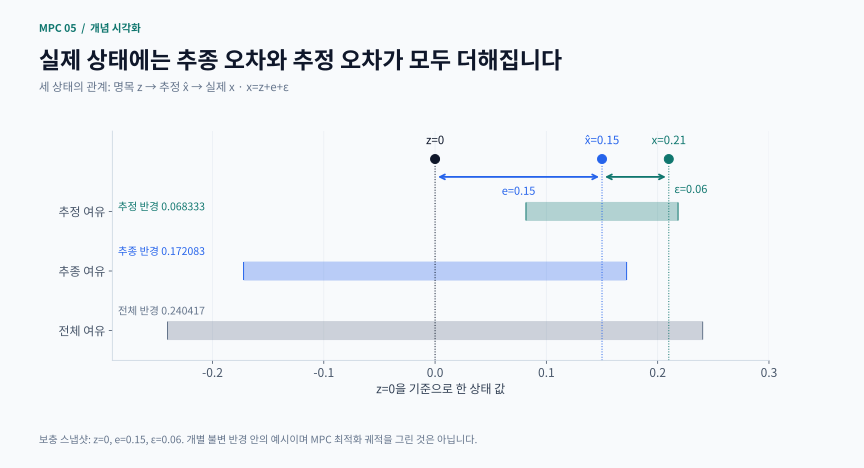
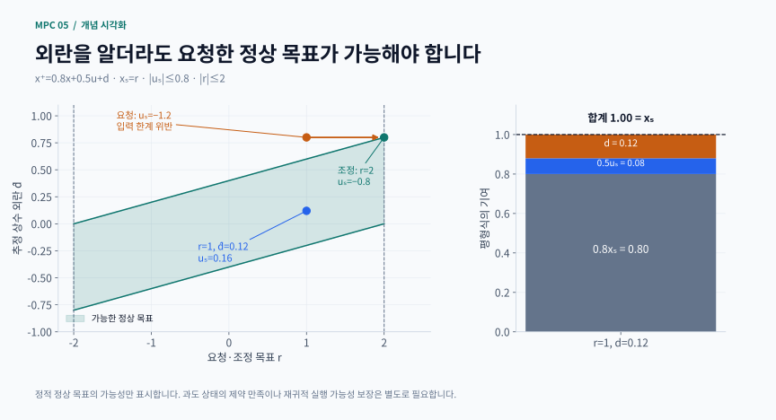

# 5장 · 출력 피드백 MPC

이 문서는 Rawlings·Mayne·Diehl, Model Predictive Control: Theory, Computation, and Design, 2판 1쇄(2017) 제5장, 인쇄 339–368쪽을 공부하기 위한 비공식 한국어 해설입니다. 책 전체의 번역이나 정리의 증명을 대체하지 않습니다. 아래 수치는 본문에 명시한 작은 보충 모델의 계산이며, 책의 모든 수치 예제를 재현한 것은 아닙니다.

## 길잡이

1. 무엇을 배우는가 → 2. 세 상태와 두 오차 → 3. 강인 출력 MPC 계산 → 4. 집합·확률·초기조건 → 5. 오프셋 제거 → 6. 그림 읽기 → 7. 실습과 점검 → 8. 자료

### 학습 목표와 선수 지식

- 센서 출력 y만으로 제어할 때 상태 x 대신 추정치 x̂를 쓰는 이유와 그 한계를 설명한다
- 추정 오차와 추종 오차를 따로 계산하고, 두 오차에 맞춰 상태·입력 제약을 축소한다
- 관측기 안정성, 제약 만족, 정상상태 오프셋 제거를 서로 다른 요구 사항으로 구분한다
- 외란 추정, 정상상태 목표 계산, 목표 중심 비용을 연결한다

2장의 명목 MPC, 종단 비용·종단 집합, 3장의 강인 불변 집합, 4장의 상태 관측기를 먼저 복습하면 좋습니다. 특히 “행렬의 모든 고유값이 단위원 안에 있다”와 “유계 외란에서 오차가 정확히 0이 된다”는 같은 말이 아닙니다.

## 1. 상태 피드백에서 출력 피드백으로

기본 모델은 x⁺ = Ax + Bu + w, y = Cx + η입니다. x는 물리 상태, u는 입력, y는 측정값, w는 과정 외란, η는 센서 잡음이고 ⁺는 다음 시간을 뜻합니다. 직접 측정하지 못하는 상태가 있으면 현재 출력만으로 미래를 예측할 수 없습니다. 과거의 입력·측정과 초기 정보를 요약하는 추정기가 필요합니다.

이론적으로는 상태의 조건부 분포 전체가 정보 상태가 될 수 있습니다. 실용 설계에서는 평균·공분산이나 추정치·오차 집합으로 단순화합니다. 다만 같은 추정 평균이라도 불확실성이 다르면 제약 위반 위험은 달라집니다. 무제약 선형 LQG의 분리 원리를 제약·비선형 문제에 그대로 옮겨 “관측기와 MPC를 따로 안정화하면 끝”이라고 결론 내리면 안 됩니다.

실습은 예측형 관측기를 사용합니다. x̂_k에는 k−1 시각까지의 측정이 반영되어 있습니다. 먼저 u_k를 계산하고, y_k로 x̂_(k+1)을 갱신합니다. 현재 측정으로 현재 추정치를 먼저 보정하는 구현과 시간 인덱스가 다르므로 코드 순서를 확인하세요.

## 2. 세 상태와 두 겹 오차: §5.2–5.3

- 실제 상태 x: 공정 안에서 실제로 움직이는 값
- 추정 상태 x̂: 센서와 모델로 계산한 값
- 명목 상태 z: 외란 없는 최적화 모델의 중심
- 명목 입력 v: MPC가 결정하는 입력
- 추정 오차 ε = x − x̂, 추종 오차 e = x̂ − z

따라서 x = z + e + ε입니다. 추정치와 실제 상태의 차이만 보면 안 됩니다. 측정 보정으로 추정치 자체도 명목 경로에서 흔들립니다.

예측형 관측기와 실제 입력을 다음과 같이 둡니다.

$$
\hat{x}^{+}=A\hat{x}+Bu+L(y-C\hat{x}),\quad z^+=Az+Bv,\quad u=v+Ke
$$

L은 관측기 이득, K는 추정치를 명목 중심으로 되돌리는 피드백 이득입니다. 양쪽 식을 빼면 다음 오차계가 나옵니다.

$$
\begin{gathered}
\varepsilon^+=(A-LC)\varepsilon+w-L\eta \\
e^+=(A+BK)e+L(C\varepsilon+\eta)
\end{gathered}
$$

첫 번째 식의 w와 η가 작아도 두 번째 식에는 ε까지 들어갑니다. 관측기와 제어기의 오차를 순서대로 계산하는 이유입니다. ε가 집합 Σ 안에, e가 집합 S 안에 머물면 실제 상태는 z + S ⊕ Σ 안에 있습니다. ⊕는 두 집합에서 하나씩 뽑아 더한 모든 점의 집합입니다.

상태 제약이 x∈X라면 $z\in X\ominus(S\oplus\Sigma)$, 입력 제약이 u∈U라면 $v\in U\ominus KS$로 줄입니다. ⊖는 어떤 허용 오차가 더해져도 원래 집합을 벗어나지 않게 중심을 제한하는 연산입니다. 입력에는 Kε가 아니라 Ke가 들어간다는 점에 주목하세요.

## 3. 손으로 계산하는 강인 여유

다음 스칼라 보충 모델을 생각합시다.

a = 1.1, b = 0.5, c = 1, L = 0.7, K = −1

|w| ≤ 0.02, |η| ≤ 0.03, |x| ≤ 2, |u| ≤ 0.8

오차계의 계수는 a−Lc = 0.4, a+bK = 0.6입니다. 둘 다 절댓값이 1보다 작습니다. 대칭 구간 |ε|≤sε가 다음 시간에도 유지되려면

0.4sε + 0.02 + 0.7×0.03 ≤ sε

여야 합니다. 등호로 최소 반경을 구하면 sε = 0.041/0.6 = 0.0683333입니다. 관측기 보정 항의 최대 크기는 δmax = 0.7×(0.0683333+0.03) = 0.0688333입니다. 따라서

$$
\begin{gathered}
s_e=\frac{\delta_{\max}}{1-0.6}=0.1720833 \\
s_x=s_{\varepsilon}+s_e=0.2404167
\end{gathered}
$$

명목 상태 한계는 2−sx = 1.7595833, 명목 입력 한계는 0.8−|K|se = 0.6279167이 됩니다. 즉 최적화가 |z|≤1.7595833과 |v|≤0.6279167을 지키면, 위 오차 가정 아래 원래 상태·입력 제약을 지킬 여유가 있습니다.

숫자를 얻었다고 설계가 끝난 것은 아닙니다. 처음의 ε와 e가 해당 구간 안에 있어야 하고, 축소 집합이 비어 있지 않아야 하며, 명목 MPC도 실행 가능해야 합니다. 실제로 관측기 극점이 안정해도 잡음 증폭 때문에 축소 입력 한계가 음수가 되는 L이 있습니다. “더 빠른 관측기”가 항상 더 안전한 제어기는 아닙니다.

강인 MPC를 설계할 때는 예측 길이, 이차 비용, DARE 종단 비용과 불변 종단 구간을 함께 정해야 합니다. 명목 중심은 이전 z와 v로 전파합니다. 매번 z=x̂로 덮어쓰면 여기서 분석한 e의 동역학과 재귀적 실행 가능성 논리를 그대로 사용할 수 없습니다. 지속적인 외란 아래 실제 x의 원점 수렴 대신 명목 중심 주변 오차 집합으로의 접근을 해석해야 합니다.

보충 계산 시각화 · 두 오차를 구분해야 실제 상태의 여유가 보입니다

추정 오차 반경 0.068333과 추종 오차 반경 0.172083을 더하면 실제 상태의 보수적 반경은 0.240417입니다. 입력에는 Ke만 들어가므로 입력 여유에는 추종 반경만 사용합니다.

적용 범위: 임의의 허용 스냅샷이며 시간 시뮬레이션 아님. 개별 구간의 민코프스키 합 경계이며 더 작은 결합 불변 집합 경계와 구분.

[PNG로 크게 보기](../../docs/assets/diagrams/ch05_two_errors.png)

## 4. 작은 경계와 작은 RMS는 다른 주장이다

개별 오차의 구간을 더하는 방법은 안전하지만 보수적일 수 있습니다. ε와 e가 같은 η를 공유하기 때문입니다. 두 오차를 ζ=(ε,e)로 묶어 ζ⁺=Fζ+G(w,η)를 계산하면 가능한 조합을 더 정확히 보존할 수 있습니다. 결합 오차의 특정 방향에 대한 상한은 단순 구간 합보다 작을 수 있습니다. 실제 개선량은 결합 동역학과 외란 집합으로 계산해야 합니다.

여기에는 중요한 조건이 있습니다. 작은 경계는 해당 결합 불변 집합의 초기조건을 요구합니다. ε와 e가 각각 개별 구간 안에 있다는 사실만으로는 충분하지 않습니다. 예를 들어 둘 다 각자의 양의 최대값에서 시작하면 합은 0.2404167이므로 작은 경계를 이미 위반합니다. 유한 단계 도달 다각형도 곧바로 무한 시간 불변 집합이 되지 않습니다. 무한 급수를 잘라 계산했다면 남은 꼬리의 상한까지 더해야 합니다.

확률 관점에서는 평균 제곱 성능을 따로 계산합니다. 독립·영평균의 균등 과정·측정 잡음을 가정할 때 결합 정상 공분산 P가 있으면

$$
\mathrm{Var}(x-z)=P_{11}+P_{22}+2P_{12}
$$

입니다. 두 오차가 독립이라는 추가 근거 없이 교차항을 버리면 틀립니다. 이 실습의 RMS 약 0.0242는 평균 성능 척도이며 모든 경로에 대한 강인 여유가 아닙니다. 균등 잡음의 누적을 근거 없이 가우스로 취급해 “3σ면 안전”이라고 말할 수도 없습니다.

§5.4의 시변 집합은 초기 정보에 맞춰 sε,k와 se,k를 재귀적으로 갱신합니다. 시작할 때 e=0이면 추종 반경이 0에서 커질 수 있고, 초기 추정 불확실성이 크면 추정 반경은 줄어들 수 있습니다. 반경 전파만 계산하는 것과 시변 튜브 MPC 전체를 구현하는 것은 구분해야 합니다.

## 5. 오프셋 제거는 외란 추정과 목표 재계산의 결합

상수 외란을 d⁺=d로 모델링하고 상태와 함께 추정합니다. 일반형은 x⁺=Ax+Bu+B_d d, y=Cx+C_d d입니다. 원래 (A,C)가 검출가능해도 확장 모델이 검출가능한지는 다시 확인해야 합니다. 상수 외란이 만드는 고유값 1의 모드를 출력으로 구분할 수 있어야 합니다.

이 모드의 계수 검사는 M₁ = [[I−A, −B_d], [C, C_d]]의 열 계수가 상태 수+외란 상태 수와 같은지 확인하는 것입니다. 원래 계의 다른 불안정 모드도 검출가능해야 합니다. 외란 상태를 센서 수보다 많이 추가하면 이 열 계수 조건을 만족할 수 없습니다. A=1, B_d=0, C=C_d=1이면 (x,d)=(0,1)과 (1,0)이 같은 출력을 만들어 둘을 구별할 수 없습니다.

외란 추정값 d̂를 얻으면 평형 목표 (x_s,u_s)를 다시 계산합니다.

$$
x_s=Ax_s+Bu_s+B_d\hat{d}
$$

제어할 출력의 목표 등식 = 요청 설정값

x_s와 u_s는 허용 제약을 만족

외란 상태를 입력으로 0에 보내려는 문제가 아닙니다. 현재 외란을 견디면서 출력을 원하는 값에 유지할 상태·입력을 찾는 문제입니다.

### 두 번째 수치 예: 왜 유지 입력이 달라지는가

x⁺ = 0.8x + 0.5u + d, y=x, 목표 r=1, 실제 상수 외란 d=0.12를 생각합니다. 정확히 추정했다면 x_s=1이고

$$
\hat{d}=0.12:\quad x_s=1,\quad u_s=\frac{(1-0.8)\cdot1-0.12}{0.5}=0.16
$$

입니다. 외란을 무시하면 u_s=0.4로 계산합니다. 양의 외란이 이미 상태를 밀어 주는데 이전 입력을 그대로 쓰면 과잉 작동하는 셈입니다. 비용도 (z−x_s)² + R(v−u_s)²처럼 목표 입력을 중심으로 둡니다. 필요한 유지 입력까지 v²로 벌주면, 외란을 정확히 알아도 원하는 평형을 떠나는 절충이 생길 수 있습니다.

목표 자체의 가능성도 확인해야 합니다. |u_s|≤0.8이면 |0.2r−d̂|≤0.4가 필요합니다. r=1, d̂=0.8에서는 u_s=−1.2이므로 원래 요청은 불가능합니다. 상태 한계 |x_s|≤2까지 고려하면 가능한 가장 가까운 목표는 2, 입력은 −0.8입니다. 정적 목표 조정만으로 과도 상태의 제약이나 재귀적 실행 가능성까지 보장되지는 않습니다.

오프셋 제거 실습은 잡음 없는 상수 외란 아래 관측기 기반 명목 MPC입니다. 앞의 강인 튜브 보장을 이 부분에 자동 적용하지 않습니다. 외란이 계속 변하면 추정 지연과 목표 이동 때문에 잔여 오차가 남습니다. 확장 검출가능성, 가능한 목표, 적합한 비용과 폐루프 수렴 조건을 갖춰야 정상상태 오프셋 제거를 이야기할 수 있습니다.

보충 계산 시각화 · 외란 추정값에 따라 달라지는 정상 목표의 가능 영역

초록 띠는 |0.2r−d̂|≤0.4와 |r|≤2를 만족하는 목표입니다. d̂=0.8에서 r=1은 불가능하지만 r=2, uₛ=−0.8은 경계에서 가능합니다. 오른쪽은 d=0.12일 때 유지 입력 0.16이 평형식을 맞추는 계산입니다.

[PNG로 크게 보기](../../docs/assets/diagrams/ch05_target_feasibility.png)

## 6. 두 계산을 나란히 읽기

강인 여유와 오프셋 제거는 서로 다른 질문에 답합니다. 앞의 두 오차 도식은 허용 잡음·초기 오차 아래에서 실제 상태와 명목 중심의 차이를 얼마나 감쌀지 보여 줍니다. 정상 목표의 가능 영역은 현재 외란 추정값에서 어떤 평형 입력과 출력 목표가 가능한지 보여 줍니다. 정적 목표가 가능하다는 사실만으로 과도 상태의 강인 안전성이 따라오지는 않습니다.

## 7. 흔한 오해와 학습용 보충 문제

- 오해: x̂가 제약 안이면 x도 안전하다 → 추정 오차와 명목 추종 오차를 모두 계산해야 합니다
- 오해: L을 크게 하면 무조건 좋다 → 오차 극점뿐 아니라 측정 잡음 증폭과 입력 여유를 확인해야 합니다
- 오해: 외란 상태를 넣으면 모든 목표를 추적한다 → 검출가능성과 목표 제약을 먼저 확인하세요
- 오해: 비선형 관측기의 오차 경계를 구하면 비선형 MPC도 안정하다 → 추정·제어 결합과 종단 설계는 별도 분석입니다

1. 측정 잡음 한계만 0.06으로 두 배 늘리면 두 반경과 축소 입력 한계는 얼마인가요?
   - 힌트: sε를 먼저 계산한 뒤 se를 계산하세요. 결과는 약 0.10333, 0.28583, 0.51417입니다
2. 왜 입력 여유는 |K|(sε+se)가 아니라 |K|se인가요?
   - 힌트: 실제 구현식 u=v+K(x̂−z)에서 직접 확인하세요
3. r=1, d̂=−0.4일 때 목표 입력이 가능한가요?
   - 힌트: u_s=1.2이므로 한계 0.8을 넘습니다. 외란 추정 성공과 목표 가능성은 별개입니다
4. 결합 경계 0.13542를 기존 MPC에 바로 넣으면 왜 위험한가요?
   - 힌트: 개별 최대 반경의 모서리 초기값을 대입하세요
5. f(x)=0.8x+0.1tanh(x), L=0.6이면 관측 오차의 수축 계수가 왜 최대 0.3인가요?
   - 힌트: f′의 범위 0.8–0.9에 평균값 정리를 적용하세요. 그 결과를 제어기 전체의 안정성 주장과 구분하세요

아래 독립 실행 예제는 결합 오차의 공분산과 교차 공분산을 계산합니다. 유계 외란 기반의 강인 튜브 설계와 확률적 공분산 계산은 서로 다른 가정임에 유의하세요. 잡음 한계, 초기조건, 솔버 상태와 제약 잔차를 기록하고, 표본 그래프와 해석적 불변성 검사를 별도로 읽으면 좋습니다.

## 8. 자료와 검증 범위

이 사이트의 개념 도식과 수식 카드는 본문의 모델·수치로 새로 제작했습니다. 교재에서 가져온 모델·예제는 해당 문단에 출처를 표시합니다. 각 장의 독립 실행 예제는 명시된 작은 보충 문제를 다루며, 교재의 모든 계산이나 증명을 재현하는 구현은 아닙니다. 수치 결과는 모델, 정보 시점, 잡음 가정과 허용오차를 함께 확인해 주세요.

## 핵심 수식 카드

일반 수학·제어식을 새로 조판한 복습 카드입니다. 성립 가정은 각 카드와 본문을 함께 확인하세요.

- **세 상태를 연결하는 두 오차**: 실제·추정·명목 상태와 추정 오차·추종 오차의 결합 동역학
- **두 겹 튜브의 상태·입력 여유**: 추정 오차와 추종 오차를 반영한 강인 제약 축소의 수치 예
- **오차가 상관되면 교차항을 남긴다**: 공유 측정 잡음 때문에 두 오차 사이 공분산을 무시하면 안 됨
- **외란 추정과 정상 목표 재계산**: 외란이 만드는 유지 입력 변화를 정상상태 식으로 계산

원전: [저자 공식 교재 사이트](https://sites.engineering.ucsb.edu/~jbraw/mpc/) · Rawlings·Mayne·Diehl (2017), 제5장

## 관련 영상

[Integral action — disturbance model augmentation](https://web01.usn.no/~roshans/mpc/videos/lecture7/integral-action-disturbance-model.mp4)

제공: University of South-Eastern Norway · IIA4117 Model Predictive Control

외란 상태를 추가하고 추정해 정상상태 offset을 없애는 접근을 살펴본다. 출력 피드백에서 모델 증강·상태 추정·목표값 계산의 역할을 교재와 비교한다. Offset-free 부분의 보조 강의다.

[영상 제공 기관의 안내](https://home.usn.no/~roshans/mpc/)

교재의 공식 장별 강의가 아닌 보조 자료입니다. 제목·설명으로 관련성을 확인했으며 전체 시청 검증은 아닙니다.
