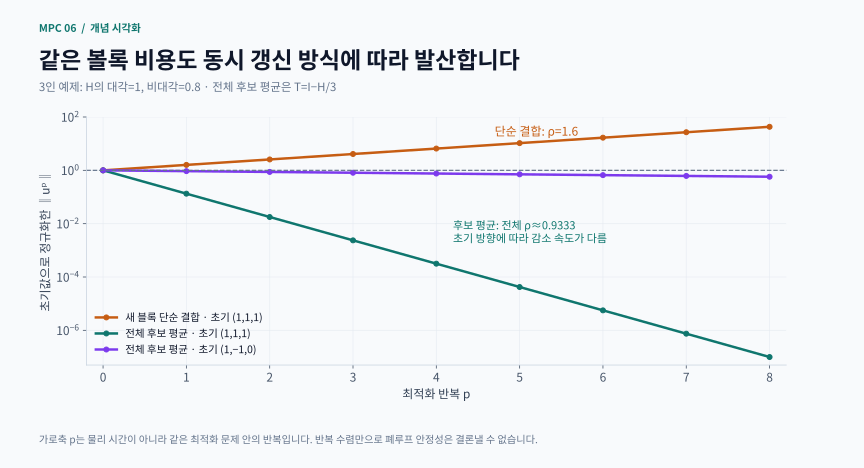
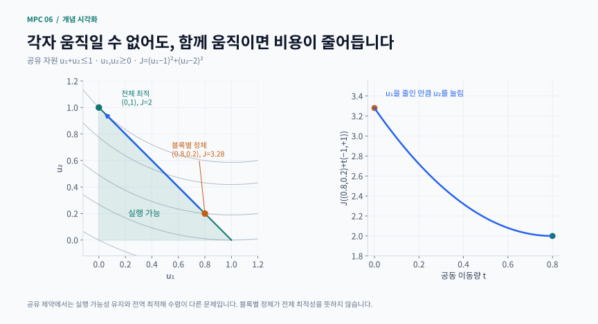

# 6장 · 분산 MPC

Rawlings·Mayne·Diehl, Model Predictive Control: Theory, Computation, and Design, 2판 1쇄(2017) 제6장, 인쇄 369–450쪽의 비공식 한국어 학습 해설입니다. 교재의 전체 번역·증명·연습문제 해답이 아닙니다. 일부 원본 예제와 직접 설계한 보충 실습을 연결하되, 실제 여러 장치의 통신 실험으로 해석하지 않습니다.

## 길잡이

1. 제어 방식 네 가지 → 2. 반복과 시간 → 3. 협조 갱신의 계산 → 4. 독립·결합 제약 → 5. 유한 반복 안정성 → 6. 목표·추정·비선형 확장 → 7. 그림과 실습 → 8. 자료

### 학습 목표와 선수 지식

- 중앙집중·분권·비협조·협조 제어의 모델 및 목적함수 차이를 설명한다
- 내시점의 존재, 최적화 반복의 수렴, 실제 폐루프 안정성을 구별한다
- 각자의 새 입력을 붙이는 방식과 전체 후보 벡터를 평균하는 방식을 직접 계산한다
- 유한 반복 MPC에서 이전 입력 계획과 종단 조건이 왜 필요한지 설명한다
- 공유 자원과 비볼록성에서 기존의 수렴 논리가 왜 달라지는지 판단한다

선수 지식은 선형 MPC의 이차 비용, 행렬 고유값, 볼록성, 기울기, 종단 비용과 이동 구간입니다. 출력 피드백과 외란 보상 부분은 4·5장을 먼저 공부하세요. 분산 제어는 한 큰 최적화 문제를 여러 계산 주체가 나눠 푸는 구조이지만, 나눠 푼다는 사실만으로 안전성과 속도 향상이 따라오지는 않습니다.

## 1. 무엇을 나누고, 누구의 비용을 줄이는가?

부분 시스템 i의 일반적인 선형 모델을 x_i⁺ = A_i x_i + Σ_j B_ij u_j로 생각해 봅시다. 자기 입력 u_i 외에 상대 입력 u_j도 자기 상태에 영향을 줍니다. 이 결합을 어떻게 모델링하고 목적함수에 넣느냐에 따라 제어 방식이 나뉩니다.

- 중앙집중: 모든 입력을 한꺼번에 선택하여 전체 비용 J를 최소화합니다. 분산 계산의 비교 기준이 됩니다
- 분권: 다른 참여자의 입력 계획을 공유하지 않고 국소 모델로 설계합니다. 무시한 결합 때문에 개별 제어기는 안정해도 전체 계가 불안정할 수 있습니다
- 비협조: 상대의 입력 계획과 결합 모델은 알지만 자기 비용 J_i만 줄입니다. 자기 입력이 상대에게 주는 손해는 최적화 목표에 없을 수 있습니다
- 협조: 자기 입력 블록만 바꾸되 전체 비용 J를 줄입니다. 목적은 같고 계산할 변수만 나눕니다

이 네 방식을 “통신이 있느냐 없느냐”만으로 구분하면 중요한 차이를 놓칩니다. 정확한 정보를 공유해도 각자가 다른 목적을 추구하면 중앙집중 최적해에 도달하지 않을 수 있습니다. 반대로 공통 목적을 사용하더라도 갱신 알고리즘을 잘못 고르면 반복이 발산할 수 있습니다.

## 2. 세 인덱스와 세 가지 안정성 질문

k는 물리적 시간, p는 같은 k 안에서 수행하는 최적화 반복, N은 예측 구간입니다. U_k^p는 k 시각의 p번째 반복에서 가진 전체 미래 입력 열입니다. 반복을 마친 뒤 그중 첫 입력만 실제 공정에 적용하고, 다음 시각에는 측정 상태와 이동한 계획으로 다시 계산합니다.

질문 A: 내시점이나 최적해가 존재하는가?
질문 B: 지금 선택한 반복법이 그 점으로 수렴하는가?
질문 C: 그 제어를 적용한 실제 상태가 시간 k에 따라 안정해지는가?

선형 반복 오차가 e^(p+1)=T e^p이면 수렴 조건은 ρ(T)<1입니다. ρ는 고유값 절댓값의 최댓값인 스펙트럴 반지름입니다. 반면 정적인 선형 제어 u=Kx를 실제 선형 계에 적용한 폐루프는 x⁺=(A+BK)x이므로 ρ(A+BK)를 검사합니다. 이 두 행렬은 서로 다른 시스템을 기술합니다. 유한 반복·기억이 있는 제어기는 단일한 K만으로 표현되지 않을 수도 있습니다.

교재 예제 6.9–6.11(2017, 인쇄 pp.389–392)은 최적화 반복의 수렴성과 폐루프 안정성을 따로 살펴보는 데 도움이 됩니다. 반복 행렬의 스펙트럴 반지름과 실제 입력을 적용한 폐루프 행렬의 스펙트럴 반지름은 서로 다른 양입니다. “최적화를 충분히 오래 돌리면 제어도 안정한다”는 결론을 그대로 내리면 안 됩니다.

반복이 발산하는 경우, 연립식을 직접 풀어 얻은 고정점의 폐루프 성질을 발산하는 실제 알고리즘의 성능으로 해석해서도 안 됩니다. 아래 독립 실행 코드는 작은 볼록 QP의 수렴과 비용 감소에 집중하며 이 교재 모델들의 폐루프를 구현하지 않습니다.

## 3. 선형 MPC를 이차 문제로 보기: §6.1

동역학을 대입하여 예측 상태를 제거하면 고정된 현재 상태 x에서 비용을 다음처럼 쓸 수 있습니다.

$$
J(U;x)=\frac{1}{2}U^THU+(Fx)^TU+\frac{1}{2}x^TYx
$$

U는 모든 참여자의 예측 입력 열, H는 입력에 관한 비용 곡률, Fx는 상태에 따라 바뀌는 일차항, 마지막 항은 U와 무관한 값입니다. H가 양의 정부호이면 무제약 유일 최적해는 HU*=−Fx를 풀어 구합니다. 역행렬을 명시적으로 만드는 대신 선형 방정식 솔버를 사용하는 편이 좋습니다.

상태를 변수로 남기고 동역학 등식을 포함한 KKT 시스템을 풀거나, 리카티 재귀를 사용할 수도 있습니다. 같은 모델·비용·종단 조건이면 서로 다른 계산법이 같은 해를 줘야 합니다. 동일한 문제를 풀었다면 허용오차 안에서 입력과 목적함수 값이 일치하는지 확인하세요. 해의 일치는 구현 검증이며 분산 반복의 수렴이나 제어 안정성 증명은 별개입니다.

## 4. 협조 반복의 핵심: 전체 후보를 평균한다

두 참여자의 현재 계획이 U^p=(U₁^p,U₂^p)라고 합시다. 참여자 1은 상대 계획을 고정해 자기 블록만 최적화하고, 참여자 2도 같은 이전 계획을 기준으로 계산합니다.

$$
\begin{gathered}
V_1=(U_1^*,U_2^p),\qquad V_2=(U_1^p,U_2^*) \\
U^{p+1}=\omega_1V_1+\omega_2V_2,\quad\omega_i>0,\quad\sum_i\omega_i=1
\end{gathered}
$$

가중치는 ω_i>0, ω₁+ω₂=1입니다. ½씩 쓰면 각 블록은 자기 최선 반응 방향으로 절반만 움직입니다. (U₁*,U₂*)를 그대로 붙이는 계산과 다릅니다.

현재 계획이 실행 가능하고, 각 후보도 실행 가능하며 J(V_i)≤J(U^p)이면, 볼록 비용과 볼록 허용 집합 아래

$$
J(U^{p+1})\leq\sum_i\omega_iJ(V_i)\leq J(U^p)
$$

가 됩니다. 첫 부등식은 볼록성이 주고, 두 번째는 각 참여자의 개선이 줍니다. 이 부등식만으로 언제나 전역 최적해 수렴을 주장할 수는 없습니다. 허용 집합의 블록 구조, 갱신 조건, 매끈함 등의 가정을 확인해야 합니다.

### 손으로 계산하는 세 참여자 예

J(u)=½uᵀHu, H의 대각 원소는 1, 비대각 원소는 0.8이라고 둡니다. H의 고유값은 0.2, 0.2, 2.6이므로 엄격 볼록이고 최적해는 u=0입니다. 그런데 u=(1,1,1)에서 각 참여자가 상대 입력을 고정하면 자기 최선값은 −0.8×(1+1)=−1.6입니다.

세 새 값을 그대로 붙이면 (−1.6,−1.6,−1.6)이 됩니다. 다음에는 각 성분이 2.56이 됩니다. 크기가 매번 1.6배씩 커지므로 발산합니다. 비용도 처음 3.9에서 9.984로 증가합니다. 볼록 문제가 잘못된 동시 갱신을 구해 주지 못하는 셈입니다.

올바른 전체 후보는 (−1.6,1,1), (1,−1.6,1), (1,1,−1.6)입니다. 이를 ⅓씩 평균하면 (0.133333,0.133333,0.133333)이 되어 비용이 약 0.069333으로 줄어듭니다. 반복 행렬도 단순 결합의 T_raw=I−H에서 후보 평균의 T_avg=I−H/3으로 바뀝니다. 전체 스펙트럴 반지름은 각각 1.6과 약 0.933333입니다. 방금 초기값은 빠른 모드에 놓였으므로 한 단계 감소가 특히 크지만, 모든 초기값이 같은 속도로 줄어드는 것은 아닙니다.

보충 계산 시각화 · 단순 동시 결합과 전체 후보 평균의 서로 다른 수렴

단순 결합은 초기 (1,1,1)에서 크기가 1.6배씩 커집니다. 후보 평균은 수렴하지만 (1,1,1)은 빠른 모드, (1,−1,0)은 느린 모드이므로 감소 속도가 다릅니다.

[PNG로 크게 보기](../../docs/assets/diagrams/ch06_cooperative_iteration.png)

## 5. 독립 입력 제약과 공유 자원: §6.3–6.4

독립 상자 제약 |U_i|≤l_i는 곱집합 구조입니다. 상대 블록을 그대로 두고 자기 블록만 범위 안에서 움직여도 전체 실행 가능성이 유지됩니다. 작은 두 참여자 이차 문제에서 입력 상자 제약을 두고 중앙집중 QP와 분산 해를 비교할 수 있습니다. 아래 독립 실행 예제는 고정된 볼록 최적화 문제에 대한 비교이며, 불안정 시스템의 종단 안정성 조건 전체를 구현하지는 않습니다.

공유 자원은 다릅니다. u₁,u₂≥0, u₁+u₂≤1이고 J=(u₁−1)²+(u₂−2)²를 최소화한다고 합시다. 현재 (0.8,0.2)에서 상대를 고정하면 어느 쪽도 자기 입력을 더 늘릴 수 없습니다. 각자의 블록 최적화가 멈추지만 전체 최적점은 (0,1)입니다.

현재 비용은 0.04+3.24=3.28이고, (0,1)의 비용은 1+1=2입니다. 경계에서 u₁을 줄이는 만큼 u₂를 늘리는 공동 방향 (−1,+1)으로 움직여야 자원을 재배분할 수 있습니다. 블록별로 움직일 여지가 없다는 것과 전체 개선 방향이 없다는 것은 다릅니다.

또한 (0,0)에서 개별 최선값을 단순 결합하면 (1,1)이 되어 자원 한계를 위반합니다. 전체 후보 (1,0)과 (0,1)의 평균 (0.5,0.5)은 실행 가능합니다. 그러나 실행 가능하다는 사실만으로 최적성이 보장되지는 않습니다.

### 몇 번 계산해야 충분할까?

“비용 변화가 작다”는 종료 기준은 정체와 최적점을 구분하지 못할 수 있습니다. 미분가능 볼록 비용 f와 실행 가능한 상자 U∈[−l,l]ⁿ에는 계산 가능한 최적성 오차 상한이 있습니다.

$$
\begin{gathered}
0\leq f(U)-f^*\leq g(U) \\
g(U)=\nabla f(U)^TU+l\|\nabla f(U)\|_1
\end{gathered}
$$

이는 접평면 하한을 상자 전체에서 최소화해 얻습니다. f*를 미리 알 필요가 없습니다. 강볼록성에 근거한 하한도 사용할 수 있다면 각각의 가정이 충족되는지 확인한 뒤 더 작은 유효 상한을 정지 기준으로 사용할 수 있습니다. 반복 횟수만 기록하기보다 상한과 실제 비용 변화도 함께 기록하세요.

이 값은 목적함수 오차입니다. 첫 입력의 오차, 폐루프 안정성, 통신 지연 허용량을 뜻하지 않습니다. 정확한 전체 기울기와 곡률 정보가 필요하고 공유 제약에 상자 공식을 그대로 쓰면 안 됩니다. 활성 제약의 최적점에서는 원래 기울기가 0이 아닐 수 있으므로 투영 기울기 잔차를 함께 봐야 합니다.

보충 계산 시각화 · 공유 자원 경계를 따라 움직이는 공동 개선 방향

(0.8,0.2)에서는 상대 입력을 고정한 각 참가자가 개선하지 못합니다. 두 입력을 (−1,+1) 방향으로 함께 바꾸면 실행 가능성을 유지하면서 (0,1)까지 비용을 낮출 수 있습니다.

[PNG로 크게 보기](../../docs/assets/diagrams/ch06_shared_resource.png)

## 6. 유한 반복 MPC의 안정성: 시간 간 연결

계산 시간이 부족하면 각 k에서 최적해까지 수렴시키지 못합니다. 이때 이전 입력 열 U는 제어기의 내부 기억입니다. 같은 물리 상태 x에서도 기억이 다르면 다른 입력을 적용할 수 있습니다. 예를 들어 x=0이어도 이전 입력 계획이 0이 아니고 한 번의 갱신으로 그 계획을 모두 제거하지 못하면 첫 입력이 남을 수 있습니다. 비용 감소 하나만으로 물리 상태 원점의 불변성이 보장되는 것은 아닙니다.

안정성 분석의 연결 고리는 다음 두 단계입니다.

1. 이전 계획의 첫 입력을 버리고 끝에 적절한 종단 정책을 붙여 다음 시작 계획 U_warm을 만듭니다
2. 분산 반복은 그 실행 가능한 시작점보다 비용이 나쁘지 않은 새 계획을 선택합니다

종단 조건이 적절하면 첫 단계에서 $J(U_{\mathrm{warm}};x^+)\leq J(U;x)-\ell(x,u)$를 얻고, 두 번째 단계에서 $J(U_{\mathrm{new}};x^+)\leq J(U_{\mathrm{warm}};x^+)$를 얻습니다. 두 부등식을 합쳐 시간 간 감소를 설명합니다. ℓ은 단계 비용입니다.

재귀적 실행 가능성, 종단 감소 조건, 양의 정부호 비용과 제어기 기억에 관한 조건을 함께 확인해야 합니다. 끝에 0을 붙이는 것이 항상 옳은 것은 아닙니다. 안정한 모델에서도 영 입력 꼬리를 쓰려면 그 입력에 맞는 종단 비용과 실행 가능성 조건을 확인해야 합니다. 다른 불안정 모델에 같은 꼬리 입력을 붙여도 된다고 추정하면 안 됩니다.

## 7. 목표 추적·추정·비선형 확장

0이 아닌 목표에서는 평형 입력도 결합되어 있습니다. 안정한 A에서 정상상태 이득은 G=C(I−A)⁻¹B입니다. 자기 대각 이득만 보고 u_i=r_i/G_ii로 계산하면 전체 출력 Gu가 r과 달라질 수 있습니다. 교재 예제 6.12(2017, 인쇄 pp.401–404)의 출력 순서를 바꾸면 비협조 목표 반복의 수렴성이 달라지지만, 같은 출력 가중치를 사용한 협조 비용은 행 교환으로 바뀌지 않습니다. 목표 계산 반복의 그래프를 공정의 시간 응답으로 읽지 마세요.

국소 관측기도 다른 참여자의 실제 적용 입력을 알아야 합니다. 상대 입력을 누락하면 관측기에 지속적인 모델 오차가 남습니다. 잡음 없는 예측형 관측기를 분석했다면 잡음이 있는 경우의 보장을 별도로 검토해야 합니다. 확장 외란 관측기를 사용하는 오프셋 보상에는 국소 검출가능성·실제 입력 공유·결합을 고려한 목표 계산이 필요합니다. 제5장의 강인 잡음 보장을 자동으로 가져오지 않습니다.

비선형 문제에서는 각 후보가 비용을 낮춰도 평균 후보의 비용이 높아질 수 있습니다. 볼록성 부등식을 잃었기 때문입니다. 한 가지 접근은 블록별 투영 기울기와 Armijo 후퇴 탐색으로 후보를 만든 뒤 실제 결합 비용을 검사하고, 필요하면 후보를 제외하여 가중치를 다시 정하는 것입니다. 수렴한 점은 일반적으로 정상점이며 전역 최적해라고 보장하지 않습니다.

비선형 보충 제어 모델은 x⁺=0.7x+0.08tanh(swap(x))+u이고 |u_i|≤0.6입니다. swap은 두 상태의 순서를 교환합니다. 영 입력에서 ‖f(x,0)‖≤0.78‖x‖이므로 종단 비용 c‖x‖²에 c=1/(1−0.78²)를 쓰면 필요한 감소 부등식을 얻습니다. 상태 강제약이 없고 영 입력이 항상 가능하다는 가정을 함께 기억하세요. 이는 별도로 다루는 교재의 불안정 다항식 예제 6.22(2017, 인쇄 pp.429–432)에 적용되는 종단 조건이 아닙니다.

## 8. 흔한 오해와 학습용 보충 문제

### 흔한 오해

- “내시점이 있으니 최선 반응도 수렴한다” → 해 존재와 선택한 반복 행렬의 수렴성은 별개입니다
- “자기 비용을 줄이면 전체 비용도 줄어든다” → 비협조 목적에서는 상대에게 주는 영향이 빠질 수 있습니다
- “전체 비용이 줄면 제어도 안정하다” → 같은 시간의 반복 감소와 시간 간 감소를 구분해야 합니다
- “엄격 볼록이면 새 블록 동시 결합도 안전하다” → 세 참여자 반례를 다시 계산하세요
- “분산 알고리즘의 순차 모사 시간이 실제 병렬 시스템 성능이다” → 통신·동기화·하드웨어의 비용을 별도로 측정해야 합니다

### 학습용 보충 문제와 힌트

1. 세 참여자 예에서 u=(1,−1,0)으로 시작하면 후보 평균의 첫 결과는 무엇인가요?
   - 힌트: 이 벡터는 H의 고유값 0.2에 대응하므로 (1−0.2/3)배, 즉 약 (0.93333,−0.93333,0)입니다
2. 공유 자원 예에서 (0.8,0.2)+t(−1,+1)의 비용을 전개해 보세요
   - 힌트: J(t)=3.28−3.2t+2t²이고 0≤t≤0.8입니다. 끝점이 왜 더 좋은지 확인하세요
3. 최적점의 원래 기울기가 0이 아니어도 가능한 이유를 1차원으로 설명하세요
   - 힌트: min (u−2)², 0≤u≤1에서 u=1을 보세요
4. 통신 지연으로 참여자들이 서로 다른 이전 계획을 기준으로 후보를 만들면 어느 부등식을 다시 확인해야 하나요?
   - 힌트: 모든 후보가 동일한 기준 계획보다 비용을 줄이고 실행 가능하다는 전제부터 점검하세요. 아래 독립 실행 예제는 통신 지연을 모델링하지 않습니다
5. 비선형 후보 두 개의 비용이 낮을 때 왜 평균 비용도 직접 계산해야 하나요?
   - 힌트: 두 점 사이에 높은 비용 영역이 있을 수 있습니다. 정상점과 전역 최적점의 차이도 함께 설명하세요

## 9. 자료와 검증 범위

이 사이트의 개념 도식과 수식 카드는 본문의 모델·수치로 새로 제작했습니다. 교재에서 가져온 모델·예제는 해당 문단에 출처를 표시합니다. 각 장의 독립 실행 예제는 명시된 작은 보충 문제를 다루며, 교재의 모든 계산이나 증명을 재현하는 구현은 아닙니다. 수치 결과는 모델, 정보 시점, 잡음 가정과 허용오차를 함께 확인해 주세요. 아래 독립 실행 예제는 교재 예제 6.22의 폐루프나 종단 영역을 재현하는 코드가 아닙니다.

## 핵심 수식 카드

일반 수학·제어식을 새로 조판한 복습 카드입니다. 성립 가정은 각 카드와 본문을 함께 확인하세요.

- **분산 계산의 공통 출발점: 축약 QP**: 축약 이차 비용과 계산 수렴·제어 안정성의 서로 다른 판정
- **협조 갱신은 전체 후보를 평균**: 전체 실행 가능 후보의 볼록 결합이 보존하는 비용 감소
- **중앙집중 최적해 없이 비용 오차 인증**: 볼록 비용의 접평면 하한에서 얻는 상자 제약 최적성 오차 인증
- **유한 반복 MPC는 시간 사이를 연결**: 이동 초기화의 시간 간 감소와 분산 반복의 개선을 결합

원전: [저자 공식 교재 사이트](https://sites.engineering.ucsb.edu/~jbraw/mpc/) · Rawlings·Mayne·Diehl (2017), 제6장

## 관련 영상

[Two Vehicles Exchanging Predictions with Coordination Rules](https://www.youtube.com/watch?v=rRM5sYlxdkw)

제공: UC Berkeley · Model Predictive Control Lab

두 제어기가 예측을 주고받을 때 조정 규칙이 어떤 역할을 하는지 보는 시뮬레이션 데모다. 같은 공식 페이지의 'without coordination rules' 영상과 비교하면 좋다. 협력 DMPC 수렴·안정성 증명을 설명하는 강의는 아니다.

[영상 제공 기관의 안내](https://sites.google.com/berkeley.edu/mpc-lab/research/past-research/large-scale-predictive-control)

교재의 공식 장별 강의가 아닌 보조 자료입니다. 제목·설명으로 관련성을 확인했으며 전체 시청 검증은 아닙니다.
