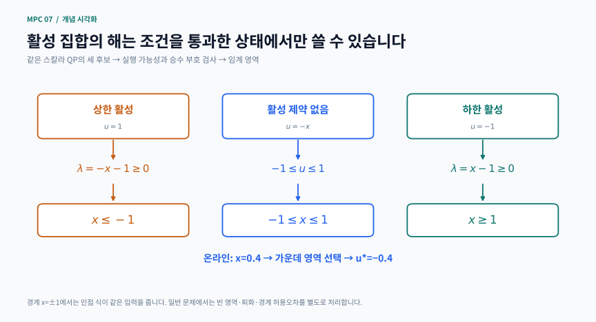
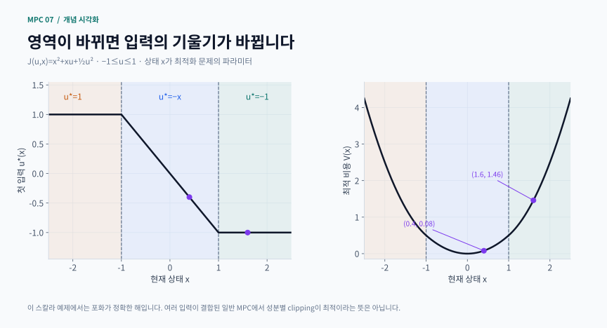

# 7장 · 명시적 MPC

이 자료는 Rawlings·Mayne·Diehl의 Model Predictive Control: Theory, Computation, and Design 제7장을 공부하기 위한 비공식 한국어 해설입니다. 책 전체 번역이나 연습문제 해답집이 아니라, 개념을 직접 계산하고 작은 실행 예제로 확인하도록 재구성한 학습 가이드입니다.

## 학습 지도

읽는 순서: ① 목표와 준비 → ② 파라미터 QP → ③ 활성 집합과 임계 영역 → ④ 손계산 예제 → ⑤ 그림 읽기 → ⑥ 연속성·퇴화 → ⑦ DP·LP → ⑧ 구현·검증 → ⑨ 연습

핵심 질문은 “상태가 바뀔 때마다 최적화를 다시 풀지 않고, 상태에 따른 답의 식을 미리 저장할 수 있을까?”입니다. 제약 선형 MPC에서는 정해진 가정 아래 가능합니다. 다만 온라인 계산이 줄어드는 대신 오프라인 영역 계산과 저장 공간이 늘어납니다.

## 1. 학습 목표와 준비 지식

이 장을 마치면 다음을 설명할 수 있어야 합니다.
- 현재 상태를 최적화 변수와 구분하고, 상태가 최적 문제의 파라미터라는 뜻을 설명하기
- 활성 제약을 고정했을 때 최적 입력이 아핀 함수가 되는 과정을 KKT 조건에서 유도하기
- 전체 입력 열의 임계 영역, 첫 입력의 식, 실행 가능 상태 집합을 구분하기
- 유일한 입력, 유일한 승수, 연속인 비용, 미분 가능한 비용을 서로 다른 성질로 판단하기
- 명시적 제어법칙과 온라인 QP의 결과를 독립적으로 비교하기

필요한 준비는 행렬 곱과 선형 연립방정식, 볼록 이차함수, 선형 부등식, MPC의 예측 입력 열입니다. x는 현재 상태, U=[u₀,…,uₙ₋₁]은 앞으로 사용할 입력의 열, u₀는 지금 실제로 적용할 첫 입력입니다. 아핀 함수 Kx+k에는 상수항 k가 있습니다. “선형 피드백”이라는 말을 넓게 쓰더라도 여기서는 이 차이를 기억하세요.

## 2. MPC를 파라미터 이차계획으로 바꾸기

선형 동역학 xₖ₊₁=Axₖ+Buₖ를 반복 대입하면 미래 상태 열은 X=Sₓx+SᵤU로 쓸 수 있습니다. 상태를 제거한 제약 LQ 문제의 한 표준형은 다음과 같습니다.

$$
\begin{gathered}
\min_U\ J(U,x)=\frac{1}{2}U^THU+U^TFx+\frac{1}{2}x^TYx \\
GU\leq Wx+b,\qquad H\succ0
\end{gathered}
$$

H는 입력 열에 대한 이차 비용, F는 상태와 입력의 교차항, Y는 상태만의 비용을 나타냅니다. G,W,b에는 입력 한계, 예측 상태 한계, 종단 제약이 들어갑니다. x를 고정하고 U만 최적화하므로 마지막 항은 최적 입력을 바꾸지 않지만 최적 비용을 계산할 때 반드시 필요합니다.

H가 양의 정부호이면 각 실행 가능한 x에서 입력 열의 최적해는 유일합니다. 실행 가능 상태 집합은 “제약을 만족하는 U가 적어도 하나 있는 x들의 집합”입니다. 상태 상자에 들어간다고 해서 미래 제약까지 만족할 수 있는 것은 아닙니다. 실행 가능 집합 밖에 저장된 식을 임의로 연장하면 원래 MPC를 구현한 것이 아닙니다.

명시적 MPC는 이 문제의 답 U*(x)를 미리 구합니다. 온라인 QP와 다른 비용을 쓰는 근사법이 아니라, 같은 문제의 해 구조를 저장하는 접근입니다. 실제 구현에서 표를 단순화하거나 근사할 때는 그때 생기는 오차를 별도로 평가해야 합니다.

## 3. 활성 집합에서 임계 영역까지

최적점에서 등호를 만족하는 부등식을 활성 제약이라고 합니다. 활성 인덱스 집합을 I라 하고 해당 행만 모은 행렬을 Gᵢ, Wᵢ, 벡터를 bᵢ라 합시다. 부등식 승수 λᵢ는 0 이상입니다. 정지 조건과 활성 제약은 다음 두 식입니다.

$$
HU+Fx+G_I^T\lambda_I=0,\qquad G_IU=W_Ix+b_I
$$

H가 양의 정부호이고 Gᵢ의 행들이 선형 독립이면 이 결합 선형 시스템을 풀어 U=Kᵢx+kᵢ, λᵢ=Lᵢx+lᵢ를 얻습니다. 오른쪽이 x의 아핀 함수이므로 해도 아핀 함수입니다. 실제 계산에서는 큰 역행렬을 직접 만들기보다 선형 시스템을 풉니다.

하지만 이 식은 아직 후보입니다. 다음을 모두 만족하는 x만 모아야 합니다.
- 모든 원래 부등식: G(Kᵢx+kᵢ)≤Wx+b
- 활성 승수의 부호: Lᵢx+lᵢ≥0
- 원래 지정한 파라미터 상태 범위

이 조건들은 x의 선형 부등식이므로 다면체 영역을 만듭니다. 이를 임계 영역으로 사용합니다. 어떤 후보는 모순되어 비어 있고, 어떤 후보는 선이나 점처럼 내부가 없을 수 있습니다. 단순히 활성 집합 조합 수를 세어서는 실제 영역 수를 알 수 없습니다.

각 영역에서 U가 아핀 함수이므로 첫 입력 u₀도 아핀 함수이고, 이를 비용에 대입하면 최적 비용 V(x)는 그 영역에서 이차함수입니다. 이것이 구간별 아핀 제어법칙과 구간별 이차 가치함수의 연결입니다. “구간”은 1차원에서만 선분이고, 여러 상태에서는 다면체입니다.

직접 제작한 개념 도식 · 후보 아핀 식을 유효한 임계 영역으로 제한하는 과정

활성 제약을 고정해 얻은 입력 식이 모든 상태에서 유효하지는 않습니다. 원래 부등식과 활성 승수의 비음수 조건을 함께 확인해야 실제 영역이 됩니다.

[PNG로 크게 보기](../../docs/assets/diagrams/ch07_active_set_regions.png)

## 4. 손으로 풀어 보는 세 영역 예제

다음 작은 보충 문제를 생각합시다.

$$
J(u,x)=x^2+xu+\frac{1}{2}u^2,\qquad -1\leq u\leq1
$$

먼저 제약을 무시하면 ∂J/∂u=x+u=0이므로 u=−x입니다. 이것이 입력 범위 안에 있으면 그대로 쓰고, 범위를 넘으면 가까운 끝점이 최적입니다. 이 스칼라 문제에서만큼은 포화가 정확한 해를 만듭니다.

$$
\begin{gathered}
x<-1:\quad u^*=1,\qquad V=x^2+x+\frac{1}{2} \\
-1\leq x\leq1:\quad u^*=-x,\qquad V=\frac{1}{2}x^2 \\
x>1:\quad u^*=-1,\qquad V=x^2-x+\frac{1}{2}
\end{gathered}
$$

x=0.4에서는 u*=−0.4, V=0.08입니다. x=1.6에서는 제약 없는 입력 −1.6을 쓸 수 없으므로 u*=−1, V=2.56−1.6+0.5=1.46입니다. 이때 하한을 −u−1≤0으로 쓰면 정지 조건은 x+u−λ=0이고 λ=0.6≥0입니다. 입력을 더 낮추고 싶다는 비용의 경향을 활성 제약이 막고 있습니다.

경계 x=1에서 가운데 식과 오른쪽 식은 모두 u*=−1, V=0.5입니다. 입력은 이어지지만 입력의 기울기는 −1에서 0으로 바뀝니다. 이 예제의 비용 기울기는 이어지지만, 이 한 사례로 모든 파라미터 QP의 비용이 매끄럽다고 결론 내리면 안 됩니다.

또한 여러 시점과 상태 제약이 결합된 MPC에서는 무제약 입력 열을 성분별로 자르는 방법이 일반적으로 최적해가 아닙니다. 스칼라 예제의 쉬운 구조를 일반 제약 문제에 그대로 옮기지 마세요.

보충 계산 시각화 · 구간별 아핀 입력과 구간별 이차 최적 비용

경계 x=±1에서 입력과 비용은 이어지지만 입력 기울기는 바뀝니다. 가운데는 u=−x, 양쪽은 입력 한계에서 포화됩니다.

[PNG로 크게 보기](../../docs/assets/diagrams/ch07_explicit_scalar.png)

## 5. 다변수 예제와 첫 입력 식의 재사용

다변수 MPC에서는 전체 입력 열 U의 아핀 표현과 지금 적용하는 첫 입력 u₀의 표현을 구분해야 합니다. 전체 입력 열을 선택하는 행렬을 E₀라고 하면 U=Fᵢx+gᵢ인 영역에서 u₀=E₀Fᵢx+E₀gᵢ입니다.

서로 다른 영역에서 미래 입력이 달라도 첫 입력의 계수 E₀Fᵢ, E₀gᵢ는 같을 수 있습니다. 이때 계수를 재사용해 저장량을 줄일 수 있지만, 원래 영역의 합이 하나의 다면체가 된다는 뜻은 아닙니다. 반평면과 실행 가능 영역 판정은 여전히 필요합니다. 영역 번호도 안정성 등급이나 비용 순위가 아닙니다.

## 6. 경계, 퇴화, 민감도를 정확히 해석하기

적절한 볼록 파라미터 QP 조건에서 유일한 해는 실행 가능 영역에서 연속인 구간별 아핀 구조를 가집니다. 그러나 “연속”은 “어디서나 같은 기울기”가 아닙니다. 활성 제약이 달라지는 경계에서 기울기는 바뀔 수 있습니다. 비용의 미분 가능성에는 별도의 정칙성 조건을 살펴야 합니다.

교재 예제 7.11은 최적 입력의 유일성과 비용의 미분 가능성, 승수의 유일성을 구분할 때 참고할 사례입니다. 활성 제약의 입력 법선이 종속이면 승수가 유일하게 정해지지 않을 수 있습니다. 종속 행을 모두 넣은 KKT 행렬이 특이하다고 해서 입력 자체가 비유일하다는 뜻은 아닙니다. “유일하지 않은 것은 입력인가, 승수인가?”를 먼저 물어보세요.

현재 영역을 aⱼᵀx≤bⱼ로 쓰고 내부점 x̄를 고르면, 경계까지의 보수적인 유지 반지름은 다음과 같습니다.

$$
a_j^Tx\leq b_j,\qquad r=\min_{j:a_j\ne0}\frac{b_j-a_j^T\bar{x}}{\|a_j\|_2}
$$

영이 아닌 법선에 대해서 계산합니다. ‖e‖₂≤r인 측정 섭동에서는 같은 닫힌 영역 안에 머물고, 그 영역의 첫 입력 식 u₀=kᵢᵀx+cᵢ에 대해 Δu₀=kᵢᵀe, |Δu₀|≤‖kᵢ‖₂‖e‖₂입니다. 경계에서 r=0이어도 입력이 불연속이라는 뜻은 아닙니다. 이는 제어법칙의 측정 민감도이며, 실제 상태에 잘못된 측정값의 입력을 적용해도 모든 제약이 지켜진다는 강인 보장은 아닙니다.

## 7. DP와 LP까지 연결하기

동적 계획법의 한 단계는 Vₖ(x)=minᵤ{ℓ(x,u)+Vₖ₊₁(Ax+Bu)}입니다. 다음 단계의 가치함수가 여러 이차 조각이면 각 조각으로 가는 입력 후보, 입력 경계, 상태 경계를 함께 고려합니다. 후보 비용들을 비교한 하단 포락선이 새 가치함수가 됩니다. 이차함수 하나만 최소화하고 끝내면 다른 조각의 더 좋은 후보를 놓칠 수 있습니다.

스칼라 DP에서는 각 이차 조각의 내부·경계 후보와 비용 교점을 계산해 가치함수를 구성할 수 있습니다. 구간이 길어지면 새로운 활성 집합이 생기거나 일부 영역이 사라질 수 있으므로 영역 수가 매번 같은 비율로 늘어난다고 가정하면 안 됩니다. 아래 독립 실행 예제는 한 단계 스칼라 QP의 세 구간 제어법칙에 집중합니다.

선형 비용이나 절댓값·노름 비용을 사용하면 보조변수로 LP를 만들 수 있습니다. 예를 들어 |u|는 t≥u, t≥−u 아래 t를 최소화해 표현합니다. LP는 최적값이 하나여도 최적 입력의 선분 전체가 존재할 수 있습니다. 솔버가 반환한 한 점은 유일성의 증거가 아닙니다.

작은 ε‖U‖²/2를 더하면 유일한 해를 얻는 데 도움이 되지만 원래 목적함수를 바꿉니다. 원래 LP 비용을 최적으로 유지하면서 특정 해만 고르는 사전식 최적화와도 구분해야 합니다. 정규화가 원래 선형 비용에 손실을 줄 수 있으므로 원래 목적함수의 값도 별도로 확인해야 합니다.

## 8. 구현과 검증의 체크리스트

오프라인에서는 후보 활성 집합, 아핀 계수, 각 영역의 반평면을 구성합니다. 온라인에서는 상태를 읽고 포함 영역을 찾은 뒤 첫 입력을 평가합니다. 경계에서 여러 영역이 동시에 선택될 수 있으므로 허용오차와 입력 일치성을 점검합니다. 실행 가능 영역 밖의 요청과 NaN, 잘못된 상태 차원도 처리해야 합니다.

명시적 제어법칙을 구현할 때 다음 순서로 확인하세요.
1. 상태 제거 전 동역학·비용·제약과 축약 QP가 같은 문제인지 확인하기
2. 영역 내부뿐 아니라 꼭짓점과 공유 경계를 검사하기
3. 전체 U, 첫 입력 u₀, 비용 V를 각각 비교하기
4. 원래 부등식 잔차와 KKT 정지 잔차를 별도로 확인하기
5. 폐루프 그래프가 좋아 보이는 것과 일반적인 안정성 증명을 구분하기

검증에서는 실행 가능 판정의 불일치 수, 명시적 입력과 온라인 QP 해의 최대 차이, 공유 경계의 입력·비용 일치성을 기록하세요. 아래 스칼라 독립 실행 예제는 세 영역의 식을 수치 최소화 결과와 비교합니다. 유한 표본 검사는 구현을 확인하는 도구이며 모든 상태에 대한 정리를 대신하지는 않습니다.

## 9. 학습용 보충 문제와 힌트

1. 손계산 예제에서 x=−1.4의 입력, 비용, 활성 승수를 구하세요.
힌트: u≤1의 승수를 쓰면 정지 조건은 x+u+λ=0입니다. 답을 비용식에 다시 대입해 보세요.

2. 비용을 x²+xu+u²로 바꾸면 영역 경계가 어떻게 이동할까요?
힌트: 제약 없는 해는 −x/2입니다. 이것이 ±1에 닿는 상태를 찾으세요.

3. 두 영역의 전체 입력 식은 다른데 첫 행 계수가 같다면 무엇을 재사용할 수 있나요?
힌트: 계수 저장량과 영역 탐색 구조를 따로 답하세요.

4. 승수가 여러 개 존재하지만 입력은 유일할 수 있는 이유를 설명하세요.
힌트: 입력 비용의 엄격 볼록성과 활성 법선의 독립성은 다른 조건입니다.

5. 측정 오차의 크기가 영역 유지 반지름보다 작으면 실제 시스템의 상태 제약도 자동으로 만족할까요?
힌트: 반지름은 “측정값에 어떤 식을 적용하는가”를 설명합니다. 실제 상태의 미래 궤적에는 모델 오차와 잘못된 입력 적용 효과가 추가됩니다.

## 출처와 실행 범위

- [저자 공식 교재 사이트](https://sites.engineering.ucsb.edu/~jbraw/mpc/): 원전과 판본 안내

원전 독서 범위는 2017년 2판 1쇄 제7장 인쇄 pp.451–490. 이 사이트의 개념 도식과 수식 카드는 본문의 모델·수치로 새로 제작했습니다. 교재에서 가져온 모델·예제는 해당 문단에 출처를 표시합니다. 각 장의 독립 실행 예제는 명시된 작은 보충 문제를 다루며, 교재의 모든 계산이나 증명을 재현하는 구현은 아닙니다. 수치 결과는 모델, 정보 시점, 잡음 가정과 허용오차를 함께 확인해 주세요.

## 핵심 수식 카드

일반 수학·제어식을 새로 조판한 복습 카드입니다. 성립 가정은 각 카드와 본문을 함께 확인하세요.

- **상태가 파라미터인 이차계획**: 선형 MPC를 상태 파라미터를 갖는 엄격 볼록 QP로 축약
- **활성 집합을 고정하면 아핀 해**: KKT 선형계에서 아핀 입력·승수와 임계 영역의 부등식을 유도
- **세 영역의 명시적 입력과 최적 비용**: 구간별 아핀 제어와 구간별 이차 값 함수의 손계산 예
- **같은 영역 안에서의 측정 민감도**: 다면체 경계까지 거리와 같은 아핀 입력 식의 오차 상한

## 관련 영상

[How to Run MPC Faster | Understanding Model Predictive Control, Part 5](https://www.mathworks.com/videos/understanding-model-predictive-control-part-5-how-to-run-mpc-faster-1533108818950.html)

제공: MathWorks · Melda Ulusoy

영어. 온라인 최적화를 줄이는 explicit MPC의 발상을 먼저 잡는다. 계산을 오프라인으로 옮기는 장점과 메모리·영역 수의 부담을 교재의 mpQP/구간별 affine 제어법칙과 연결한다. mpQP 증명 전체를 다루는 강의는 아니다.

[영상 제공 기관의 안내](https://www.mathworks.com/videos/understanding-model-predictive-control-part-5-how-to-run-mpc-faster-1533108818950.html)

교재의 공식 장별 강의가 아닌 보조 자료입니다. 제목·설명으로 관련성을 확인했으며 전체 시청 검증은 아닙니다.
