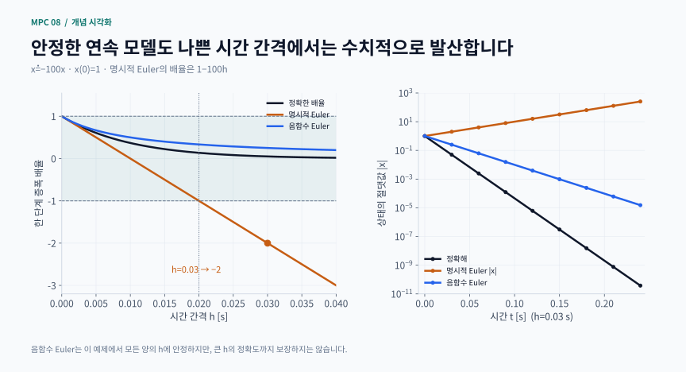
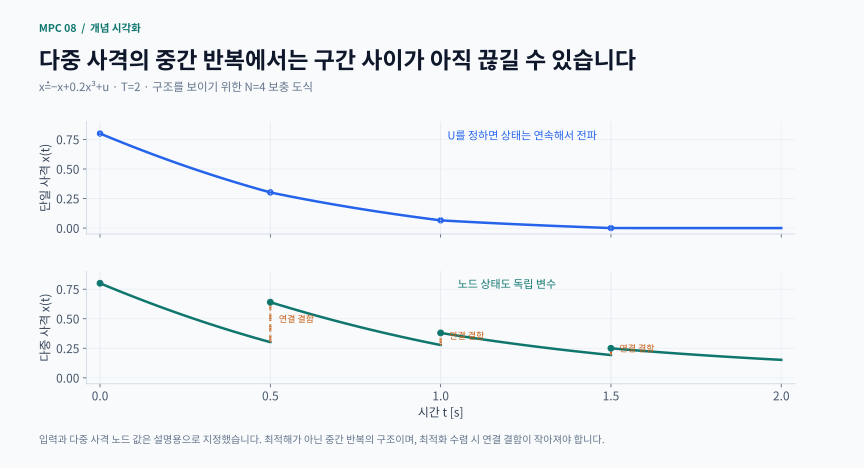
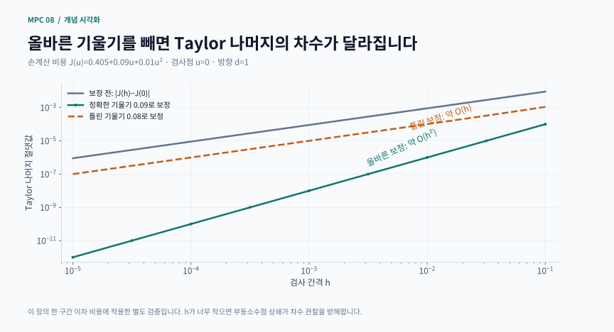

# 8장 · 수치 최적 제어

이 자료는 Rawlings·Mayne·Diehl의 Model Predictive Control: Theory, Computation, and Design 제8장을 위한 비공식 한국어 학습 가이드입니다. 원문 전체 번역이 아니라 수치 계산의 흐름을 연결하는 독자적인 설명입니다. 작은 손계산 예제는 학습용 보충 문제이고, 보충 계산은 서로 다른 모델을 사용할 수 있으므로 구분해서 읽어야 합니다.

## 학습 지도

읽는 순서: ① 목표·전체 흐름 → ② 시간 이산화 → ③ 근 찾기·미분 → ④ 단일/다중 사격·배치 → ⑤ SQP·내부점 → ⑥ 손계산 → ⑦ 구조 활용·온라인 반복 → ⑧ 독립 검증 → ⑨ 연습

한 문장 요약: 모델을 적분하고, 그 계산을 미분하고, 유한차원 최적화로 바꾼 뒤, 시간 구조를 이용해 반복 계산하는 것이 수치 최적 제어의 핵심입니다. 솔버 하나를 호출하는 것보다 무엇을 솔버에 주고 어떤 오차를 검사하는지가 중요합니다.

## 1. 목표와 필요한 배경

다음 다섯 가지가 학습 목표입니다.
- 연속시간 모델 오차, 이산화 오차, 최적화 미수렴을 구분하기
- 상태를 제거하는 사격법과 상태를 변수로 유지하는 방법의 차이를 설명하기
- SQP의 QP 하위 문제를 쓰고, 선형화된 제약 만족과 원래 제약 만족을 구분하기
- 도함수를 독립적인 차분·Taylor 검사로 검증하기
- 리카티 재귀, 축약, 이동 초기화, 실시간 반복이 무엇을 절약하는지 이해하기

행렬과 미분, 선형 연립방정식, 선형·비선형 동역학, LQ 비용, 기본 KKT 조건이 필요합니다. xₖ는 상태, uₖ는 입력, X/U는 전체 예측 열, w는 일반 최적화 변수, λ는 제약 승수입니다. 시간 격자 번호 k와 솔버 반복 번호 j를 혼동하지 마세요.

이산 최적 제어의 기본형은 다음과 같습니다.

최소화: Σₖ₌₀ⁿ⁻¹ ℓₖ(xₖ,uₖ)+V𝒇(xₙ)

제약: x₀=x̄, xₖ₊₁=fₖ(xₖ,uₖ), 그리고 상태·입력·종단 제약

현재 측정값 x̄는 파라미터입니다. 미래 상태와 입력은 결정 대상입니다. 같은 물리적 목표라도 시간 격자, 입력 매개화, 적분법, 비용 구적법이 달라지면 솔버가 푸는 유한차원 문제도 달라집니다.

## 2. 시간 이산화: 적분 정확도만 보면 충분할까?

연속 모델 ẋ=f(x,u)를 구간 길이 h로 적분해 xₖ₊₁=Φₕ(xₖ,uₖ)를 만듭니다. 구간 안에서 입력을 상수로 유지한다고 가정하면 명시적 오일러는 Φₕ=x+h f(x,u)입니다. 계산은 싸지만 충분히 작은 h가 필요합니다.

고전적인 RK4는 기울기를 네 번 평가합니다.

$$
\begin{gathered}
k_1=f(x,u),\qquad k_2=f(x+hk_1/2,u) \\
k_3=f(x+hk_2/2,u),\qquad k_4=f(x+hk_3,u) \\
x^+=x+\frac{h}{6}(k_1+2k_2+2k_3+k_4)
\end{gathered}
$$

이 k₁,…,k₄는 시간별 제어입력이 아니라 한 적분 구간 안의 중간 기울기입니다. 충분한 매끄러움 등의 조건에서 고정 구간의 전역 오차는 오일러 O(h), RK4 O(h⁴)로 감소합니다. 한 단계 오차와 전체 구간 오차의 차수도 구분해야 합니다. 비용 적분 역시 적절한 구적법으로 계산해야 하며 상태만 고차로 적분한다고 목적함수까지 자동으로 고차가 되지는 않습니다.

강직성도 고려해야 합니다. ẋ=−100x에서 명시적 오일러의 배율은 1−100h입니다. 감쇠하는 정확해와 달리 h=0.03이면 배율 −2로 수치 해가 커집니다. 음함수 오일러는 x⁺=x/(1+100h)이므로 이 예제에서 양의 h에 대해 감쇠합니다. 하지만 큰 h에서도 안정하다는 것과 정확하다는 것은 다릅니다.

비선형 음함수 적분에서는 x⁺=x+h f(x⁺,u)를 만족시키는 방정식을 풀어야 합니다. DAE는 미분 상태 외에 대수 제약도 포함하므로 일관된 초기조건과 대수 잔차 검사가 필요합니다. 적응형 적분은 오차에 맞춰 간격을 조절하지만, 최적화에 사용할 도함수와 제약 평가의 일관성도 함께 고려해야 합니다.

보충 계산 시각화 · 적분법의 안정 영역과 강직 모델의 수치 응답

명시적 Euler는 0<h<0.02에서만 이 모델의 절댓값을 줄입니다. h=0.03에서는 부호가 뒤집히며 크기가 두 배씩 커지고, 정확해는 빠르게 감쇠합니다.

[PNG로 크게 보기](../../docs/assets/diagrams/ch08_stiff_integration.png)

## 3. 비선형 방정식과 도함수 계산

r(z)=0의 뉴턴 단계는 Jᵣ(z)Δz=−r(z), z⁺=z+Δz입니다. 해 근처에서 야코비안이 비특이이고 충분히 매끄러우며 초기값이 적절하면 빠른 국소 수렴을 기대할 수 있습니다. 멀리서 시작하면 발산·순환하거나 특이한 방향을 만날 수 있습니다. 감쇠 z⁺=z+αΔz, 선탐색, 신뢰영역은 이런 위험을 줄이는 방법이지만 모든 초기값에서 성공한다는 뜻은 아닙니다. 작은 단계만 보고 수렴했다고 하지 말고 잔차도 확인하세요.

유한차분의 기본은 [J(w+h d)−J(w)]/h≈∇J(w)ᵀd입니다. h가 크면 절단 오차, 너무 작으면 두 비슷한 수의 뺄셈에서 반올림·상쇄 오차가 커집니다. 중앙차분은 양쪽 평가를 사용해 매끄러운 함수에서 절단 오차를 줄이지만 적절한 h는 여전히 필요합니다.

알고리즘 미분(AD)은 실행되는 연산 그래프에 연쇄법칙을 적용합니다. 전진 모드는 선택한 입력 방향의 변화, 역방향 모드는 선택한 출력의 입력별 민감도를 계산하는 데 유리합니다. 스칼라 비용에 입력 변수가 많다면 역방향이 특히 유용합니다. AD도 잘못된 모델이나 잘못 작성한 비용을 알아서 고쳐 주지는 않습니다.

음함수 r(z,p)=0에서 z가 파라미터 p에 따라 변하면, 정칙한 점에서 J_z dz/dp=−J_p를 풉니다. 적분 단계나 최적성 시스템의 민감도도 같은 관점으로 볼 수 있습니다. 단, 특이점이나 활성 집합 변화에서는 단순한 매끄러운 미분이 성립하는지 다시 확인해야 합니다.

## 4. 직접 최적 제어의 세 가지 매개화

단일 사격법은 U만 결정 변수로 두고 x₀부터 전 구간을 순차 모사합니다. 동역학 등식은 계산 절차에 내장됩니다. 변수 수가 작아지지만 앞쪽 입력의 영향이 뒤까지 전달되므로 민감도 행렬이 조밀해지거나 긴 불안정 궤적에서 수치 조건이 나빠질 수 있습니다.

다중 사격법은 각 구간 시작 상태도 변수로 둡니다. 구간별 적분 후 xₖ₊₁−Φₕ(xₖ,uₖ)=0이라는 연결 제약을 추가합니다. 중간 반복에서는 구간들이 아직 이어지지 않을 수 있지만, 수렴한 해에서는 연결 결함이 작아야 합니다. 변수가 늘어나는 대신 시간 방향의 희소 구조와 상태 초기 추정값을 활용할 수 있습니다.

직접 배치법은 상태를 구간 내 다항식 등으로 표현하고 특정 배치점에서 미분방정식을 만족시키게 합니다. 적분기를 밖에서 호출하는 사격법과 달리 내부 단계도 최적화 제약에 직접 나타날 수 있습니다. 서로 다른 배치법과 RK 방법이 같은 물리 문제를 근사하더라도 유한 격자에서는 서로 다른 NLP입니다.

단일·다중 사격을 비교할 때는 같은 동역학, 초기조건, 상태·입력 한계와 비용을 사용하세요. 두 방법이 같은 RK4 전이와 비용 구적을 공유한다면 결과의 일치는 동일한 이산 문제의 서로 다른 구현 비교입니다. 배치법과 비교할 때는 격자를 세분화하며 원래 연속시간 문제에 대한 수렴 경향을 함께 살펴야 합니다.

보충 계산 시각화 · 단일 사격의 연속 전파와 다중 사격의 연결 결함

같은 입력을 쓰더라도 다중 사격의 노드 초기 추정값을 별도 변수로 두면 중간 반복에서 구간이 끊길 수 있습니다. 연결 등식이 이러한 결함을 줄입니다.

적용 범위: 장에 제시된 연속 모델을 사용하되 설명용 N=4, U와 노드 초기값을 직접 지정. 최적 제어 계산 결과 아님.

[PNG로 크게 보기](../../docs/assets/diagrams/ch08_shooting_structure.png)

## 5. SQP: 비선형 문제를 국소 QP로 풀기

일반 NLP를 min J(w), c(w)=0, g(w)≤0으로 씁니다. 현재 반복점 w에서 SQP는 다음과 같은 하위 문제를 풉니다.

$$
\begin{gathered}
\min_d\ \frac{1}{2}d^TBd+\nabla J(w)^Td \\
c(w)+J_c(w)d=0 \\
g(w)+J_g(w)d\leq0
\end{gathered}
$$

d는 변수의 수정량이고, B는 라그랑지안 L=J+λᵀc+μᵀg의 헤시안 또는 그 근사입니다. 제약이 비선형이면 비용의 헤시안과 라그랑지안의 헤시안은 다를 수 있습니다. QP의 선형화 제약을 만족하더라도 w+d가 원래 비선형 제약을 정확히 만족하지는 않으므로 선탐색과 제약 잔차 검사가 필요합니다.

최소제곱 $J=\frac12\|r(w)\|^2$의 정확한 헤시안은 $J_r^TJ_r+\sum_i r_i\nabla^2r_i$입니다. Gauss–Newton은 뒤의 잔차 가중 항을 생략합니다. 양의 준정부호 구조가 장점이지만 항상 정확한 헤시안은 아니며, 잔차가 큰 곳이나 곡률이 중요한 곳에서는 차이가 커질 수 있습니다.

내부점 접근의 직관은 gᵢ(w)<0인 내부에서 −τΣlog(−gᵢ(w))를 비용에 추가하는 것입니다. 장벽 파라미터 τ를 줄이며 경계 가까이 접근합니다. 등식 제약은 따로 유지해야 합니다. 작은 로그 장벽 뉴턴 예제는 이 원리를 설명할 수 있지만, 완전한 원시·쌍대 내부점 솔버와는 다릅니다.

볼록 QP에서는 적절한 최적성 조건이 전역 최적해와 연결됩니다. 일반 비선형 NMPC에서는 작은 KKT 잔차만으로 전역 최소라고 할 수 없습니다. 국소 최소인지 판단하는 데도 제약 정칙성, 이차 조건 등 추가 검토가 필요합니다.

## 6. 손계산 예제: 이산화와 제약 QP를 연결하기

학습용으로 ẋ=−x+u, x₀=1, h=0.1을 한 구간만 고려합시다. 오일러 이산화와 입력 한계 −1≤u≤1을 사용하고, 이산 비용을 J=½x₁²+0.005u²로 정의합니다. 여기서는 이 비용 자체가 문제의 정의입니다.

x₁=1+0.1(−1+u)=0.9+0.1u

J(u)=0.405+0.09u+0.01u²

J′(u)=0.09+0.02u

무제약 해는 u=−4.5이므로 입력 한계를 위반합니다. 제약 해는 u*=−1이고 x₁=0.8, J*=0.325입니다. 이 스칼라 이차함수는 엄격 볼록하므로 이 경우에는 전역 최소임을 말할 수 있습니다.

u=0에서 정확한 헤시안 B=0.02로 SQP를 구성하면 min 0.09d+0.01d², −1≤d≤1입니다. 해 d=−1로 한 번에 원래 QP의 최적점에 갑니다. 원래 문제가 이미 이차 비용과 선형 제약이기 때문입니다. 일반 비선형 문제에서 SQP 한 번이 충분하다는 결론으로 확장하면 안 됩니다.

같은 상수 입력 u=−1을 정확한 연속 모델에 적용하면 x(0.1)=2exp(−0.1)−1≈0.809675입니다. 오일러의 0.8과 약 0.009675 차이가 납니다. 최적화 오차를 10⁻¹²로 줄여도 이 적분 오차는 사라지지 않습니다. 이산화 문제를 정확히 푸는 것과 연속시간 문제를 정확히 표현하는 것은 다른 목표입니다.

## 7. 시간 구조와 온라인 반복 활용하기

인접한 시간의 상태만 동역학으로 연결되므로, 상태·입력을 함께 유지한 KKT 행렬에는 띠 모양의 희소 구조가 생깁니다. 구조를 무시하고 조밀한 큰 행렬처럼 처리하면 계산과 메모리를 낭비할 수 있습니다.

무제약 LQ에서는 가치함수의 이차 구조를 이용해 리카티 재귀를 뒤로 계산하고, 앞으로 상태와 입력을 생성할 수 있습니다. 축약은 상태를 제거해 입력만의 QP를 만들며 변수를 줄이는 대신 헤시안이 조밀해질 수 있습니다. 같은 LQ 문제를 리카티·축약·전체 KKT로 풀었다면 입력이 수치 오차 안에서 일치하는지 비교하세요. 서로 다른 계산 구조가 같은 수학 문제를 푸는 좋은 예입니다.

iLQR는 비선형 궤적을 따라 선형화하고 이차 근사를 이용해 전진·후진 계산을 반복합니다. 동역학 이차 미분을 생략한 Gauss–Newton DDP 형태의 iLQR를 사용할 수 있으며, 기본적인 무제약 구현에는 강제약이 없습니다. 입력·상태 제약을 자동으로 처리한다고 가정하지 마세요. 특히 무제약 전체 입력 열을 단순 포화시키는 것은 제약 QP를 다시 푸는 것과 다릅니다.

온라인 MPC에서는 이전 입력 열을 한 단계 이동해 다음 문제의 초기값으로 쓸 수 있습니다. 이를 이동 초기화라고 합니다. 측정마다 소수의 갱신만 수행하는 실시간 반복은 완전한 수렴을 기다리는 계산과 피드백의 상호작용을 이용합니다. 초기 추정이 좋고 측정 변화가 작을 때의 이점을 기대하되, 솔버 실패와 제약 위반에 대한 대책은 별도로 필요합니다.

실시간 반복에서는 측정마다 최적화의 한 단계만 수행하고 다음 측정을 반영하는 전략을 생각할 수 있습니다. 입력만 최적화하고 상태를 재모사하는 구현과 동시 다중 사격 RTI는 변수·연결 결함을 다루는 방식이 다릅니다. 반복 한 번의 계산 성공만으로 실제 장치의 마감시간이나 임의 NMPC의 안정성을 보장하지는 않습니다.

## 8. 독립적인 도함수·해 검증

최적화 두 개가 같은 도함수 코드를 공유한다면 결과가 같아도 도함수의 독립 검증은 아닙니다. 특히 최적점에서는 기울기 자체가 작으므로 버그가 덜 드러날 수 있습니다. 비최적점 w와 여러 방향 d를 선택해 다음 두 양을 검사합니다.

$$
\begin{gathered}
R_0(h)=|J(w+hd)-J(w)| \\
R_1(h)=|J(w+hd)-J(w)-h\nabla J(w)^Td|
\end{gathered}
$$

방향 미분이 0이 아닌 매끄러운 점에서 보통 R₀는 O(h), 올바른 기울기를 뺀 R₁은 O(h²)입니다. h를 반으로 줄였을 때 R₁이 대략 1/4로 줄어드는 구간을 찾으세요. 너무 작은 h에서는 반올림 오차 때문에 이 관계가 깨집니다. 한 방향에서 우연히 오류가 상쇄될 수 있으므로 좌표별 중앙차분도 병행합니다.

방향 미분 항을 올바르게 제거하면 매끄러운 비용에서 보통 R₁(h)=O(h²)가 됩니다. 기울기가 틀리면 일차 잔차가 남아 R₁(h)=O(h)로 보일 수 있습니다. 너무 작은 h에서는 부동소수점 오차가 우세해지므로 중간 구간의 기울기를 보세요. 이 검사는 구현한 비용의 일차 도함수를 점검하며, 헤시안·연속시간 민감도·전역 최적성까지 검증하는 것은 아닙니다.

해 검증에서는 목적값 외에 동역학 잔차, 원래 상태·입력 제약, 정지 조건, 독립 적분 결과를 함께 봅니다. 격자점에서만 제약을 확인하면 구간 안쪽 위반을 놓칠 수 있습니다. 구간 내부 표본 검사는 도움이 되지만 연속시간 전체의 제약 보장을 대신하지는 않습니다.

보충 계산 시각화 · 기울기 구현의 정확성을 Taylor 나머지 차수로 검사하기

정확한 기울기 0.09를 빼면 나머지는 0.01h²입니다. 일부러 틀린 0.08을 빼면 0.01h+0.01h²가 남아 주로 1차로 줄어듭니다. 최적화 성공 표시와 독립적인 도함수 검사를 구분합니다.

적용 범위: 본문의 손계산 이차 비용을 사용한 보충 테스트이며, 비선형 최적제어 문제 전체의 수반 기울기를 검증하는 것은 아닙니다.

[PNG로 크게 보기](../../docs/assets/diagrams/ch08_taylor_check.png)

## 9. 학습용 보충 문제와 힌트

1. 손계산 예제의 입력 한계를 ±0.5로 바꾸면 최적 입력과 비용은 얼마인가요?
힌트: 무제약 해는 그대로입니다. 새 경계 입력을 상태식과 비용식에 대입하세요.

2. ẋ=−100x에 h=0.015와 h=0.025를 사용한 오일러 해를 비교하세요.
힌트: 배율의 절댓값이 1보다 작은지, 부호가 바뀌는지를 따로 보세요.

3. 단일·다중 사격의 최적 비용이 다르면 어디부터 확인할까요?
힌트: 같은 적분·구적·격자·제약인지, 연결 잔차가 충분히 작은지, 서로 다른 국소해에 갔는지 순서대로 점검하세요.

4. 중앙차분과 AD가 일치하는데 모델 예측은 틀릴 수 있나요?
힌트: 미분의 정확성과 모델 방정식의 정확성은 다릅니다.

5. QP 하위 문제는 실행 가능한데 SQP 갱신 후 원래 제약이 위반될 수 있는 이유를 설명하세요.
힌트: 곡선 제약과 그 접선 근사는 같은 집합이 아닙니다.

6. 실시간 반복의 상태가 원점에 가까워졌다면 무엇이 아직 입증되지 않았나요?
힌트: 모든 초기조건의 안정성, 실제 장치의 시간 제한, 외란 아래 제약 만족, 전역 최적성을 각각 생각하세요.

## 출처와 실행 범위

- [저자 공식 교재 사이트](https://sites.engineering.ucsb.edu/~jbraw/mpc/): 원전과 판본 안내
- [CasADi 공식 문서](https://web.casadi.org/docs/): 함수 구성과 알고리즘 미분 도구에 관한 추가 자료

원전 독서 범위는 2017년 2판 1쇄 제8장 인쇄 pp.491–600. 이 사이트의 개념 도식과 수식 카드는 본문의 모델·수치로 새로 제작했습니다. 교재에서 가져온 모델·예제는 해당 문단에 출처를 표시합니다. 각 장의 독립 실행 예제는 명시된 작은 보충 문제를 다루며, 교재의 모든 계산이나 증명을 재현하는 구현은 아닙니다. 수치 결과는 모델, 정보 시점, 잡음 가정과 허용오차를 함께 확인해 주세요.

## 핵심 수식 카드

일반 수학·제어식을 새로 조판한 복습 카드입니다. 성립 가정은 각 카드와 본문을 함께 확인하세요.

- **RK4의 네 기울기와 한 단계 전이**: 상수 입력 구간의 고전적 4차 Runge–Kutta 적분
- **SQP: 현재 반복점에서 국소 QP**: 선형화 제약과 라그랑지안 곡률을 쓰는 SQP 하위 문제
- **Gauss–Newton이 생략하는 곡률 항**: 최소제곱 목적의 정확한 Hessian과 Gauss–Newton 근사를 비교
- **Taylor 잔차로 도함수를 독립 검사**: 올바른 기울기를 뺀 잔차가 2차로 줄어드는 구간을 확인

## 관련 영상

[Numerical Optimal Control — Lecture 18: Direct Approaches](https://www.syscop.de/files/2017ss/NOC/recordings/190717.mp4)

제공: University of Freiburg · Moritz Diehl

연속시간 최적제어를 유한차원 최적화로 바꾸는 direct method를 교재의 shooting·collocation과 연결해 본다. 같은 강좌의 CasADi 연습문제는 구현 복습에 사용할 수 있다. 교재 공식 8장 강의가 아니라 관련 수치최적제어 강의다.

[영상 제공 기관의 안내](https://www.syscop.de/teaching/ss2020/numerical-optimal-control-online)

교재의 공식 장별 강의가 아닌 보조 자료입니다. 제목·설명으로 관련성을 확인했으며 전체 시청 검증은 아닙니다.
